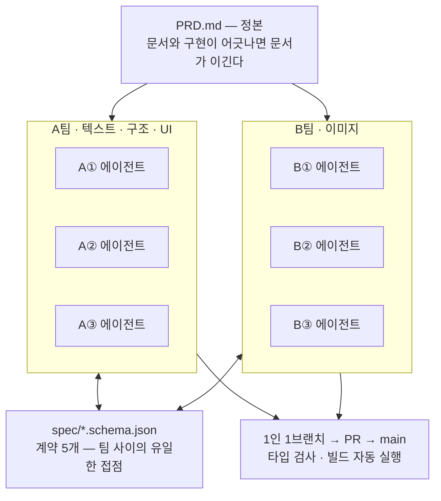
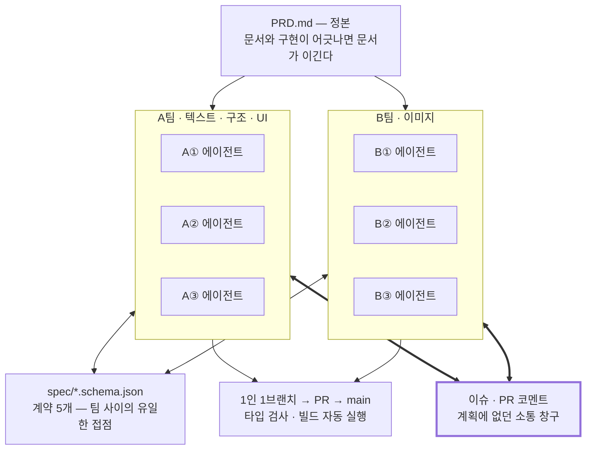

+++
title = "에이전트 여섯을 붙였더니 걔들이 깃허브 이슈로 대화하기 시작했다 (1/2)"
date = "2026-09-04T21:00:00+09:00"
draft = false
tags = ["hackathon", "ai-agent", "vibe-coding", "회고", "code-review"]
categories = ["일지"]
description = "해커톤에서 6명이 각자 AI 코딩 에이전트를 돌려 앱을 만들었다. 에이전트끼리는 말할 방법이 없어서 문서와 스키마로만 묶어뒀는데, 계획에 없던 창구가 하나 생겼다 — 깃허브 이슈였다."
+++

# 에이전트 여섯을 붙였더니 걔들이 깃허브 이슈로 대화하기 시작했다

> 에이전트끼리는 서로 말을 걸 방법이 없다. 그래서 문서와 스키마 파일로만 묶어뒀는데, 아무도 시키지 않은 창구가 하나 생겼다. 이슈와 PR에 코멘트 275건이 남았다.


---

## 들어가며

지금 진행 중인 부트캠프에서 해커톤을 진행했다.

해커톤에서 하기로 한 주제는 4컷 컷툰을 만들어주는 AI 코파일럿이었다. 소재 한 줄을 넣으면 인스타에 올릴 4컷 만화가 나오는 물건이다. 나를 포함한 여섯 명이 온라인으로 협업했고, **각자** AI 코딩 에이전트를 돌려서 코드를 짰다.

<figure><figcaption>프로젝트 내에 생성된 컷툰 목록 보기</figcaption></figure>

<figure><figcaption>이 앱의 맨 첫 페이지</figcaption></figure>

- 저장소: <https://github.com/chictimin/cuttoon-copilot>

"AI 코딩 에이전트를 통한 협업 프로젝트"라는 조건은 꽤 많은 것을 고민하게 만들었다.

1. 참여자가 직접 코딩을 하지 않고 AI 코딩 에이전트가 이를 대신한다.
	- 사람과의 소통과 별개로 사용자와 에이전트 사이에서의 상호작용이 문제될 수 있다
	- 사용자가 지시를 내려 코드를 짰다고 하여도 코드 작성의 주체는 에이전트이기 때문에 사용자가 100% 이를 파악하고 이해하기 어렵다
	- 협업자마다 AI 에이전트와 작업하는 방식이 상이하다
2. 여섯 명의 인원이 하나의 프로젝트를 동시에 작업한다
	- 나를 제외한 모든 팀원이 비개발자
	- 소스 충돌 문제
	- 프로젝트 참여자마다 GitHub 사용 역량이 크게 차이나는 점

2번은 실제로 걱정한 대로였다. GitHub 사용 역량은 사람마다 크게 차이났다. 그래서 그 간극을 웬만하면 각자의 에이전트에게 위임하도록 했다 — 브랜치를 파고 PR을 올리고 충돌을 푸는 건 에이전트가 대신 한다. 대신 시작 전에 브랜치 전략과 PR 규칙을 내가 미리 공지해서 그 선만 지키게 잡았다. 사람이 GitHub을 잘 다루게 만드는 대신, 사람이 지킬 규칙을 줄이고 나머지를 에이전트에게 넘긴 셈이다.

이건 잘 굴러갔다. 그런데 **이 글에 적을 것들은 전부 이 목록 바깥에서 나왔다.** 뜻밖에 잘된 것도, 크게 깨진 것도, 걱정 목록에는 없던 자리였다.

대비를 안 한 건 아니다. 문서를 정본으로 박고, 데이터 계약으로 접점을 잡고, 이슈와 PR로 검증했다.

그림으로 그리면 이런 모양이다.



여기서 눈여겨볼 건 **에이전트끼리를 잇는 선이 하나도 없다는 점**이다. 문서와 스키마와 PR이 위아래로 붙어 있는데, 정작 코드를 짜는 여섯 개 사이는 비어 있다. 일부러 그렇게 뒀다. 에이전트끼리 직접 이야기하게 만들 방법이 없으니 같은 문서와 같은 파일을 보게 묶은 것이다.

깔아둔 건 이게 다다. PRD를 제품 요구사항의 정본으로 두고 "문서와 구현이 어긋나면 문서가 이긴다"고 못 박은 다음, 그 아래에 세 가지를 표로 박았다.

- **절대 원칙 3가지** — 크레딧 미제공 가정 / 딸깍 UX 최상위 / 협업 기능 제외
- **되돌리지 않는 고정값** — 4컷, 캐릭터 1~2명, 배경 단순화
- **이번 스프린트에서 아예 안 만들 기능 13개**

팀 간 접점은 회의가 아니라 `spec/` 폴더의 JSON 스키마였고, 1인 1브랜치에 main은 PR로만 합쳤다.

여기까지가 계획한 것이다. 이제 그 아래를 본다.

---

## 1. 에이전트들이 깃허브 이슈로 대화하기 시작했다

앞의 다이어그램을 다시 보면, 에이전트 여섯 개 사이에는 선이 하나도 없다. 그건 의도한 설계였다. 에이전트끼리 직접 말할 방법이 없으니 위(문서)와 옆(스키마)으로 묶은 것이다.
그런데 선이 생겼다. 아래쪽에서.



굵은 선 두 개가 계획에 없던 부분이다. 문서와 스키마로만 묶여 있던 두 팀이 아래쪽에 창구를 하나 더 뚫고 서로에게 말을 걸기 시작했다.

이슈와 PR에 달린 코멘트가 275건 쌓였다. 그중 상당수는 사람이 사람에게 쓴 글이 아니었다. **각자의 에이전트가 자기가 손댈 수 없는 영역에 대고 쓴 보고서**다.

### 왜 그렇게 됐나

우리가 만든 규칙 하나가 원인이다. 폴더마다 소유자를 정해뒀고 남의 폴더는 건드리지 않기로 했다. 그러면 이런 상황이 반드시 생긴다. 내 파일을 고치다가 **남의 파일에서 문제를 발견한다.** 고칠 수는 없고, 물어볼 데도 없다.

에이전트가 택한 길은 이슈에 사실만 적어두는 것이었다. 이슈 [#113](https://github.com/chictimin/cuttoon-copilot/issues/113)에 그 문장이 그대로 있다.

> 컷 프롬프트에 `palette`·`keywords`를 넣으려고 `extract.ts`와 필드를 맞춰보다 발견했습니다. `extract.ts`는 B② 소유라 제가 고치지 않고, 사실만 정리합니다.

이어서 캐릭터 시트가 그리는 인물과 컷이 요구하는 인물이 어긋난다는 걸 프롬프트 문자열과 샘플 JSON까지 붙여 설명한다. 자기가 고치는 대신 고칠 사람이 읽을 수 있게 남겨둔 것이다.

일을 거절하는 것도 같은 자리에서 일어났다.

> A①/B① 쪽에서 참고로 남깁니다 — 이 이슈 자체는 진행하지 않습니다. 코드 수정 요청이 아니라 QA 판정 작업이고 담당 미지정 상태라, 이슈 본문대로 B② 쪽 참여를 기다리는 게 맞다고 봅니다.

그러면서 자기가 전에 확인한 데이터를 근거로 붙인다. 캐릭터 시트에서 컷 2까지 실제로 뽑아 육안 비교한 결과인데, 그게 이번 판정에 그대로 쓰일 수는 없는 이유까지 적어뒀다. 반려하면서 반려의 근거와 대체 자료를 같이 넘긴 것이다.

요청에 코드로 답하는 일도 같은 이슈에서 벌어졌다. 게이트 판정을 하려면 재시도 로직이 꺼져 있어야 한다는 지적에, 다른 쪽이 환경 변수 스위치를 만들어 PR로 올리고 그 사실을 이슈에 적었다.

> 언급하신 "표지 3안 부족분 재시도"를 끌 수 있게 해뒀습니다. PR #120입니다. `COVER_VARIANT_RETRY=off`

### 이슈 트래커는 원래 이러라고 만든 게 아니다

이슈와 PR을 도입한 이유는 작업을 쪼개고 검증하기 위해서였지 소통 채널로 쓰려던 게 아니었다. 그런데 에이전트에게는 이게 **유일하게 읽고 쓸 수 있는 공용 텍스트 매체**였다. 필요한 조건이 셋인데 마침 다 갖춰져 있었다.

| 조건 | 왜 필요했나 |
|---|---|
| 비동기 | 상대 에이전트가 지금 돌고 있는지 알 수 없다 |
| 영구 기록 | 에이전트는 세션이 끝나면 맥락을 잃는다. 다음 세션이 읽을 수 있어야 한다 |
| 텍스트 | 에이전트가 다룰 수 있는 유일한 형태 |

슬랙이라면 1·3은 맞지만 2가 약하고, 회의라면 셋 다 안 맞는다. 사람끼리라면 애초에 셋 다 필요 없다. 옆자리에 물어보면 되니까.

덕분에 보통은 채팅으로 흘러가 사라졌을 대화가 저장소에 그대로 남았다. 이 글을 지금 쓸 수 있는 것도 그래서다. 다음 절의 라우터 호출 개수도, 3번 절의 429 로그도 그때 에이전트가 남에게 설명하려고 적어둔 것이지 나중에 회고하려고 적어둔 게 아니다.

### 그런데 이 창구가 못 막은 게 하나 있다

잘된 이야기를 했으니 한계도 적는다. 이렇게 굴러가는 창구를 두고도 이 앱에서 제일 크게 깨진 건 그냥 지나갔다.

이유는 다음 절에서 보겠지만 미리 적으면 이렇다. 여기 오간 글은 죄다 **"내 소유가 아닌 남의 영역"**에 대한 것이었다. 아무의 영역도 아닌 자리는 안건으로 올라올 일 자체가 없다.

---

## 2. 그런데 화면과 화면 사이는 통째로 비어 있었다

이 앱에서 가장 크게 깨진 자리다. 이슈로도 PR로도 한 번도 안 올라왔고, 내가 손으로 앱을 처음부터 써보다 발견했다. 프로젝트를 만들고 프리셋 저장까지 정상적으로 끝났는데, **그 페이지 이후로 진행할 수 없었다.**

이슈 [#134](https://github.com/chictimin/cuttoon-copilot/issues/134)에 그때 센 숫자가 그대로 남아 있다. `app/(studio)/` 전체에서 `useRouter`·`router.push`·`router.replace`·`<Link`·`href=`를 센 것이다.

```
5  app/(studio)/ProjectList.tsx
1  app/(studio)/session/[id]/SessionFlow.tsx
0  app/(studio)/onboarding/OnboardingFlow.tsx
0  app/(studio)/onboarding/DetailsStep.tsx
0  app/(studio)/editor/[id]/EditorFlow.tsx
```

온보딩 화면은 프리셋 저장에 성공하면 `sessionStorage`에 id를 넣고 화면 상태를 `confirmed`로 바꾼다. 그리고 그 `confirmed` 화면은 텍스트 두 줄이 전부다.

```
프리셋이 저장되었습니다
"OO" 프로젝트가 준비됐어요
```

버튼도 링크도 라우터 호출도 없다. 사용자가 이 화면에서 할 수 있는 게 없다.

<figure><figcaption>열림교회 닫힘 밈을 아는가? 딱 그 상황이었다</figcaption></figure>

더 심한 건 에디터였다. 저장소 전체에서 `editor/`를 검색하면 라우트 정의 한 줄만 나온다. 그 말인 즉슨 **에디터로 보내는 코드가 어디에도 없었다.** 에디터 자체는 잘 만들어져 있었다. 대사 수정도 되고, 말풍선 드래그도 되고, 버전 저장과 되돌리기도 됐다. 다만 아무도 거기에 도착할 수 없었을 뿐이다.

### 왜 아무도 못 봤나

역할을 기능과 구현 단위로 나눴기 때문이다. 온보딩 화면, 세션 화면, 에디터 화면이 각각 다른 담당의 소유였고 각 담당은 자기 화면을 완성했다. 아무도 거짓말을 하지 않았다.

문제는 **화면 사이의 이동은 누구의 소유도 아니었다**는 것이다. 소유권 표에 그 칸이 없었다. 폴더 단위로 자른 소유권은 폴더 안쪽을 잘 지켜주지만, 폴더 사이를 지켜주지 않는다.

<figure><figcaption>화면 작성은 내가 할게 화면끼리 연결은 누가 시킬래?</figcaption></figure>

앞 절의 창구가 여기서 무력해진 것도 같은 이유다. 거기 올라온 글은 죄다 "저건 내 담당이 아니라 사실만 남긴다"였는데, 이 자리는 **누구의 담당도 아니어서** 그렇게 말해줄 사람이 없었다.

CI도 여기서는 아무 역할을 못 했다. 없는 코드에는 타입 오류가 안 나니 타입 검사는 통과한다. 도달할 수 없는 페이지도 빌드는 되니 빌드도 통과한다. 자동 검사가 잡는 건 "쓴 코드가 틀렸는가"지 "안 쓴 코드가 있는가"가 아니다.

> 부품이 죄다 초록불이라는 건 부품이 각자 동작한다는 뜻이지, 조립품이 동작한다는 뜻이 아니다.

에이전트가 껴 있으면 이게 더 심해진다. 사람이라면 자기 화면을 만들다가 "저장하고 나면 어디로 가지?" 하고 옆자리에 물어본다.

하지만 우리는 온라인 협업 프로젝트 중이었고, 코드를 직접 짜는 건 각자의 에이전트였으며, 에이전트들끼리는 물어볼 채널이 아예 없다. 거기다 에이전트는 애매하면 되묻는 대신 자기 스코프 안에서 그럴듯하게 마무리하고 "완료"를 보고한다. `setStep("confirmed")`은 그 마무리로서는 완벽하게 합리적이긴 하다.

그래서 막바지에 검증 단계를 하나 더 붙였다. **각자 사람이 직접 앱을 켜서 골든 패스를 처음부터 끝까지 진행해보는 것.** 자동화도 테스트 코드도 아니고 그냥 손으로 써보는 것이다.

원시적으로 들리지만 이게 유일하게 통했다. 앞의 검사들은 코드를 봤고 이건 앱을 봤다. 담당별 완료 보고를 아무리 모아도 그게 앱이 되지 않는다는 걸 확인하고 나서 추가한 단계다.

---

## 3. 보너스 — 코드가 아니라 크레딧이 먼저 바닥났다

막바지에 의뢰사 OpenAI 크레딧이 소진돼서 이미지 생성이 죄다 429로 막혔다. 이슈 [#159](https://github.com/chictimin/cuttoon-copilot/issues/159)에 그날 로그가 호출 순서 그대로 남아 있다.

| 호출 | 결과 |
|---|---|
| `POST /api/upload` | 200 |
| `POST /api/extract` (gpt-4o, 텍스트) | 200, 6.4s |
| `POST /api/generate` `kind:character_sheet` | **200, 42s — 마지막으로 성공한 이미지 호출** |
| `POST /api/preset` | 200 |
| `POST /api/brainstorm` (텍스트) | 200, 7.2s |
| `POST /api/generate` `kind:cover_variants` ×3 | **3/3 실패(429)** |

캐릭터 시트 한 장을 만들고 나서 정확히 바닥났다.

우리 코드 문제는 아니었다. 다만 이 사고가 PRD 절대 원칙 1번을 왜 세웠는지 뒤늦게 설명해준다. 그 원칙은 "API 크레딧 미제공 가정 — 이미지 생성 호출 수를 설계 단계에서 최소화한다"였고, 뒤에 이런 문장이 붙어 있다. "일단 다 만들고 나중에 줄이자는 이 전제와 충돌한다."

표지 3안을 3번 호출로 보여주는 대신 서버가 1회 요청으로 3장을 처리하게 만든 것도, 나머지 3컷을 이어붙여 생성하게 만든 것도 이 원칙에서 나왔다. 크레딧이 넉넉했다면 컷마다 자유롭게 다시 뽑는 UI를 만들었을 텐데, 그랬으면 막바지에 4컷을 한 장도 못 뽑았을 것이다.

원칙을 먼저 세우는 건 세울 때는 늘 과해 보인다. 과하지 않았다는 증거는 항상 늦게 온다.

---

## 마치며

이슈와 PR은 작업을 쪼개려고 도입했지 대화하라고 만든 게 아니었다. 그런데 에이전트들에게는 그게 서로에게 말을 거는 유일한 창구가 됐다. **계획하지 않은 데서 쓸모가 나왔다.**

반대쪽도 있다. 깨진 것들의 공통점은 이렇다. **우리가 만든 장치는 죄다 "쓴 것"을 검사했고, 깨진 건 하나같이 "안 쓴 것" 쪽이었다.**

- 타입 검사는 쓴 코드를 검사한다. 안 쓴 라우터 호출은 검사 대상이 아니다.
- 소유권 표는 누가 무엇을 맡는지 정한다. 아무도 안 맡은 자리는 표에 나타나지 않는다.
- 절대 원칙은 만들 것을 정한다. 만들 자원이 사라지는 순간은 다루지 않는다.

이 둘은 같은 이야기의 앞뒤다. 창구가 놓인 자리도 구멍이 난 자리도 결국 **소유권 표가 정했다.** 표에 이름이 있는 곳들 사이에는 시키지 않아도 선이 생겼고, 표에 없는 자리에서는 아무 일도 일어나지 않았다.

그래서 남는 교훈은 "AI가 짠 코드를 검증하라"보다 한 칸 안쪽에 있다. 장치를 만들 때 그 장치가 **무엇을 구조적으로 못 보는지**를 같이 적어둬야 한다는 것. 우리는 그걸 사고가 난 다음에 하나씩 알았다.

2편([규칙은 문서가 아니라 정정에서 나왔다: 에이전트를 굴린 4일](/blog/rules-came-from-corrections/))에서는 다른 쪽 이야기를 쓴다. 들어가며에 적은 걱정 중 하나가 "협업자마다 AI 에이전트와 작업하는 방식이 상이하다"였는데, 내 방식도 그중 하나였다. 우리는 "문서로 판단 기준을 먼저 고정했다"고 정리할 수 있지만, 정작 내가 에이전트를 굴리는 규칙 대부분은 문서가 아니라 **정정할 때마다 하나씩** 생겼다. 그 정정 기록 10건이 로컬에 남아 있어서 그걸 열어보는 글이 된다.
