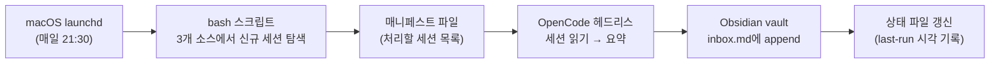

+++
title = "매일 밤, AI가 내 작업 일지를 대신 쓴다 (1편): OpenCode 헤드리스로 만든 자동 기록 파이프라인"
date = "2026-07-18T21:00:00+09:00"
draft = false
tags = ["opencode", "obsidian", "mcp", "automation", "launchd", "vibe-coding", "session-capture"]
categories = ["일지"]
description = "AI 코딩 도구를 여러 개 쓰다 보면 매일 열심히 했는데 '어제 뭐 했지?'에 답을 못 한다. 그 기록을 사람 대신 AI가 매일 밤 정리하게 만든 파이프라인 구축기 — 방향 거꾸로 설치된 삽질부터."
+++

# 매일 밤, AI가 내 작업 일지를 대신 쓴다

OpenCode 헤드리스로 만든 자동 기록 파이프라인 (1편)

> AI 코딩 도구를 여러 개 쓰다 보면, 매일 뭔가 열심히 했는데 정작 "어제 뭐 했지?"에 답을 못 한다. 그 기록을 사람 대신 AI가 매일 밤 정리하게 만든 이야기.

---

## 들어가며

요즘은 코드를 짤 때 AI 도구의 도움을 받는다. 나는 한 개도 아니고 여러 개를 번갈아 쓴다 — 터미널에서 돌리는 것, 데스크톱 앱, 또 다른 오픈소스 도구까지.

문제는 **작업이 끝나면 그 내용이 증발한다**는 것이다. AI와 두 시간을 씨름해서 골치 아픈 오류를 잡아도, 다음 날 "그거 어떻게 고쳤더라?" 하고 돌아보면 남는 건 기계가 읽으라고 만든 로그 파일뿐이다. 사람이 훑어보기엔 영 불친절하다.

그래서 생각했다. 어차피 이 AI들이 내 메모 앱(옵시디언[^1])에 직접 글을 쓸 수 있는데, 한 발 더 나아가서 — **매일 정해진 시각에, 그날 한 작업을 스스로 요약해서 기록하게 만들면 어떨까?**

이 글은 그 발상에서 시작해 "매일 밤 자동으로 도는 작업 일지 로봇"을 완성하기까지의 기록이다.

[^1]: 옵시디언(Obsidian)은 마크다운 파일로 메모를 관리하는 앱이다. 여기에 MCP(Model Context Protocol)라는 표준 연결 방식을 붙이면 AI가 내 메모 저장소(vault)를 직접 열어 읽고 쓸 수 있다. 쉽게 말해 AI에게 내 노트 앱의 열쇠를 쥐여주는 셈이다.

---

## 1. 늘 그렇듯 오해가 사고를 만든다.

사실 이 자동화는 처음 목표부터가 내가 정한 게 아니었다.

AI 코딩 도구(Claude Code)가 요청을 오해해서 "이미 쌓아둔 메모를 정식 노트로 승격시키는" — 지금과는 정반대 방향의 — 자동화를 알아서 설치하고 구현까지 밀어붙였다. 대화 중간에 스크롤이 훅 내려가는 바람에 나도 그 부분을 놓쳤고, 실제로 명령을 돌려보고 나서야 "어, 이게 아닌데" 싶었다.

일단 설치된 걸 테스트해보다가 연달아 세 번 막혔다. 전부 "내 컴퓨터에선 되는데 자동으로 돌리면 안 되는" 종류의 함정이었다.

- 첫째, macOS의 보안 설정이 자동 실행 프로그램의 파일 접근을 막았다.[^2]
- 둘째, 자동 실행 환경은 평소 터미널과 달라서 명령어의 위치를 못 찾았다.[^3]
- 셋째, 자동 실행에는 "권한을 허용하시겠습니까?"에 눌러줄 사람이 없어서 조용히 멈춰버렸다.[^4]

세 개를 다 잡고 나서야 진짜 문제가 보였다. 내가 원했던 건 "쌓인 메모를 정리"하는 게 아니라, 애초에 그날 작업을 메모로 자동 기록하는 것이었다. 방향이 반대였다. 이 부분을 다시 설명하고, 방향을 바로잡아 새로 만들기로 했다.

결국 잘못 만든 자동화는 손을 떼고(나중에 수동으로 쓰기로 하고), 진짜 필요한 것 — 그날의 AI 작업을 기록으로 남기는 쪽 — 을 처음부터 다시 만들기 시작했다. 그래도 위에서 얻어맞으며 배운 세 가지 교훈은 그대로 챙겨 왔다. 덕분에 새로 만들 땐 같은 데서 두 번 넘어지지 않았다.

[^2]: macOS는 iCloud Drive처럼 민감한 폴더에 대한 접근을 앱별로 통제한다(전체 디스크 접근 권한, Full Disk Access). 자동 실행을 담당하는 시스템 프로그램(`/bin/bash`)에도 이 권한을 줘야 하는데, 설정 목록엔 일반 앱만 보이고 시스템 파일은 숨어 있다. 권한 추가 창에서 `Cmd+Shift+G`로 `/bin/` 경로를 직접 입력해야 `bash`를 찾아 추가할 수 있었다.

[^3]: 자동 실행 환경(launchd)은 평소 터미널이 읽는 설정 파일(`.zshrc` 등)을 거치지 않아, 명령어를 찾는 경로 목록(PATH)이 최소한으로만 잡혀 있다. `claude` 같은 명령을 못 찾는 이유다. 실행 설정 파일(plist)에 PATH를 직접 명시해 근본적으로 해결했다. 특히 AI 도구가 내부적으로 또 다른 명령(`uvx`)을 호출하는데, 이 하위 프로세스도 같은 최소 PATH를 물려받아 함께 막혔다.

[^4]: 헤드리스(사람 없이 명령어로만 도는) 실행에서는 "이 폴더에 써도 됩니까?" 같은 확인 창에 답해줄 사람이 없다. 설정 파일(`~/.claude/settings.json`)의 허용 목록에 필요한 도구를 미리 등록해두는 것으로 해결했다. 단, 파일 삭제 도구는 일부러 뺐다 — 노트는 지우지 않고 추가·수정만 한다는 원칙 때문이다.

---

## 2. 매일 돌리려면 공짜여야 한다

처음 만든 버전은 Claude Code라는 도구의 "헤드리스 모드[^5]"를 썼다.

그런데 금방 벽에 부딪혔다. 이 도구는 자동 호출도 유료 사용량을 갉아먹는다. 무료 사용량은 하루치가 얼마 안 되는데, **매일 밤 꼬박꼬박 돌아야 하는 자동화**에 이걸 쓰는 건 낭비였다. 작업 요약 같은 허드렛일에 비싼 사용량을 태울 이유도 없었다.

그래서 OpenCode라는 오픈소스 도구로 갈아탔다. 결정적인 이유는 **무료 모델을 쓸 수 있다**는 점이었다.[^6] 사용량 한도가 없으니 매일 돌려도 부담이 없다. 여기에 옵시디언 연결도 지원하고, "모든 권한을 자동 승인"하는 옵션까지 있어 헤드리스 자동화에 딱 맞았다.

작은 함정이 하나 있었다. OpenCode는 명령어를 쓸 때 프롬프트를 옵션들보다 **먼저** 넣어야 한다. 순서를 바꾸면 프롬프트를 파일 이름으로 착각해 "파일 없음" 오류를 뱉는다. 이 순서를 모른 채로 클로드가 한참 헛바퀴를 돌렸다.[^7]

[^5]: 헤드리스(headless)는 화면(GUI) 없이 명령어만으로 프로그램을 돌리는 방식이다. 사람이 클릭하는 대신 정해진 명령을 자동으로 실행할 때 쓴다.

[^6]: `opencode/deepseek-v4-flash-free` 모델을 사용했다. 실행 명령은 대략 이런 형태다: `opencode run "프롬프트..." --auto -m opencode/deepseek-v4-flash-free -f manifest.txt`. `--auto` 플래그가 모든 도구 권한을 자동 승인해주는데, 사람이 승인할 수 없는 헤드리스 환경에서는 이게 필수다.

[^7]: 올바른 순서는 `opencode run "프롬프트..." --auto -m 모델`. 반대로 `opencode run --auto -m 모델 "프롬프트..."`로 쓰면 프롬프트를 파일명으로 오인해 "File not found"가 난다.

---

## 3. 세 군데에 흩어진 기록을 한곳으로

앞서 AI 도구를 세 개 쓴다고 했다.

문제는 이들이 각자 다른 곳에, 다른 형식으로 기록을 남긴다는 것이다. 터미널 도구는 폴더에 로그 파일로, 데스크톱 앱은 또 다른 폴더에 (그것도 제목과 본문을 따로), OpenCode는 아예 작은 데이터베이스[^8]에 저장한다.

그래서 스크립트가 세 곳을 각각 훑어 "지난번 이후로 새로 생긴 기록"만 골라 목록을 만들고, 그 목록을 AI에게 넘긴다.[^9] AI는 목록에 적힌 기록들을 하나씩 읽어 요약한 뒤, 옵시디언의 수집함 파일(`inbox.md`) 한 곳에 차곡차곡 append 한다.

특히 데스크톱 앱의 **에이전트 모드(Agent Mode)** 세션까지 긁어모으게 된 게 예상 밖의 수확이었다. 참고로 이건 같은 앱의 '일반 채팅'과는 완전히 다른 저장 체계다 — 일반 채팅은 브라우저 전용 포맷(IndexedDB)에 저장돼 파일로는 접근이 안 되지만, 에이전트 모드는 별도 폴더에 일반 JSON/JSONL 파일로 남는다(이 얘기는 회고에서 다시 짚는다). 아무튼 이 세션에서 한 작업은 터미널 도구 기록에는 남지 않아서 원래는 추적 사각지대였는데, 이제 전부 한곳에 모인다.

[^8]: SQLite. 파일 하나로 동작하는 가벼운 데이터베이스다. OpenCode는 세션의 제목·시각·토큰 사용량 등을 여기에 저장한다. 스크립트에서는 "실제로 오간 대화가 있는 세션"만 고르려고 `(입력 토큰 + 출력 토큰) > 0` 조건으로 걸러낸다.

[^9]: 이 "목록"을 매니페스트(manifest) 파일이라 부른다. 파일 경로를 AI에게 직접 던지면 AI가 목록을 파악하는 데 시간(=토큰)을 쓴다. 소스별로 미리 정리한 매니페스트를 주면 "무엇을 처리할지"에 바로 집중할 수 있어 더 효율적이다. 세 소스의 위치는 각각 (1) 터미널 도구: `~/.claude/projects/*/*.jsonl`, (2) 데스크톱 앱 에이전트 모드: `.../local-agent-mode-sessions/**/audit.jsonl`(제목·모델 메타데이터는 별도 폴더에 있어 세션 ID로 매칭), (3) OpenCode: `~/.local/share/opencode/opencode.db`.

---

## 4. 매일 밤 알아서 도는 구조

이 모든 과정을 매일 밤 9시 반에 알아서 돌도록 걸었다. macOS에는 "정해진 시각에 프로그램을 실행"해주는 launchd라는 기능이 있는데, 여기에 스크립트를 등록해두면 된다.[^10]

한 가지 신경 쓴 부분은 **같은 기록을 두 번 남기지 않는 것**이다. 실행에 성공하면 "여기까지 처리했다"는 시각을 파일에 적어두고, 다음 실행 때는 그 시각 이후에 생긴 세션만 가져온다. 만약 중간에 실패하면 이 시각을 갱신하지 않으므로, 다음 실행에서 놓친 세션을 다시 시도한다.[^11]

전체 흐름을 그림으로 보면 이렇다.

[^10]: launchd 실행 설정은 plist 파일에 담긴다. 매일 21:30 실행은 `StartCalendarInterval`에 `Hour=21, Minute=30`으로 지정한다. 그리고 [^3]에서 언급한 대로 `EnvironmentVariables`에 PATH를 명시해야 명령어를 찾는다. 나는 확실하게 하려고 OpenCode 바이너리 경로를 스크립트에 아예 하드코딩하기도 했다.

[^11]: 이 "여기까지 처리했다" 시각은 별도 상태 파일(`~/scripts/.session-to-inbox-last-run`)에 unix epoch 값으로 기록한다. 자동화에서 이런 멱등성(같은 걸 여러 번 실행해도 결과가 한 번 실행한 것과 같은 성질) 보장은 필수다. 안 그러면 매일 밤 같은 기록이 중복으로 쌓인다.

---

## 전체 그림

정리하면 역할이 둘로 나뉜다. **bash 스크립트**가 "어떤 기록이 새로 생겼는지 찾아 목록을 만드는" 수집·정리를 맡고, **OpenCode 헤드리스 AI**가 "그 기록들을 읽고 요약해 옵시디언에 저장하는" 실제 작업을 맡는다.

이렇게 나눈 덕에 한쪽이 흔들려도 다른 쪽이 버틴다. 가령 AI 모델이 일시적으로 불안정해도, 수집과 목록 생성은 멀쩡히 돌아간다.

이 "무엇을, 어떻게 저장할지"의 규칙은 재사용할 수 있게 하나의 스킬로 정리해뒀다. 그런데 이 스킬, 사실 처음부터 이 모양은 아니었다. 두 번을 갈아엎었다 — 그 이야기는 **2편**에서 다룬다.

---

## 회고

**공짜로 매일 돌릴 수 있다는 게 가장 컸다.** 유료 도구의 헤드리스 호출은 사용량이 금방 찼지만, OpenCode + 무료 모델 조합은 한도 걱정이 없다. 자동화가 매일 불러도 부담이 없다.

**세 소스 통합은 기대 이상이었다.** 특히 데스크톱 앱의 에이전트 모드 세션은 원래 놓치던 기록이었는데, 이제 전체 AI 작업이 한곳에서 추적된다.

아쉬운 점도 있다.

- **일반 채팅 기록은 아직 못 잡는다.** 브라우저 기반 저장소(IndexedDB)에 들어 있어 파일로 접근이 안 된다. 별도 파이프라인이 필요한데 공수가 커서 보류.
- **에러 처리가 단순하다.** 성공/실패만 구분할 뿐, 실패 원인이 모델 문제인지 권한 문제인지 구분하지 못한다.
- **요약 품질이 들쭉날쭉하다.** 특히 긴 세션에서는 중요한 결정이 누락되기도 한다.

---

## 참고 자료

- [MCPVault GitHub](https://github.com/bitbonsai/mcpvault) — Obsidian이 실행 중이 아니어도 동작해서 자동화 환경에 적합했다
- [OpenCode 공식 문서](https://opencode.ai/docs)
- [Obsidian Local REST API](https://github.com/coddingtonbear/obsidian-local-rest-api)
