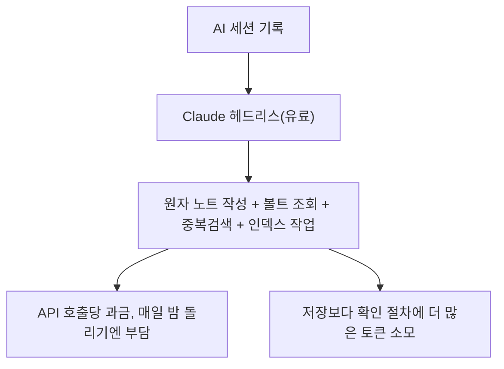
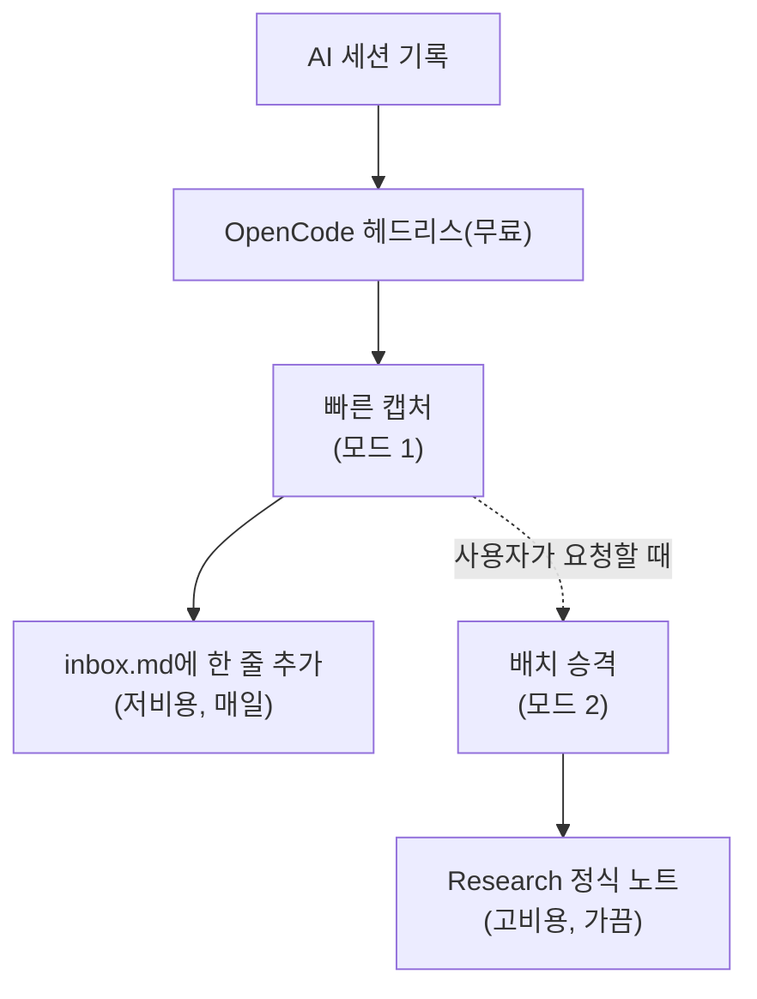

+++
title = "매일 밤, AI가 내 작업 일지를 대신 쓴다 (2편): 캡처 스킬을 세 번 만든 이야기"
date = "2026-07-19T16:00:00+09:00"
draft = false
tags = ["opencode", "obsidian", "skill", "zettelkasten", "para", "automation", "token-cost"]
categories = ["일지"]
description = "파이프라인을 구동하는 규칙집, obsidian-knowledge-capture 스킬이 세 번의 버전을 거쳐 지금의 모습이 된 이야기. 방향이 반대였던 V1, 유료라서 매일 못 썼던 V2, Inbox 패턴으로 갈아탄 V3."
+++

# 매일 밤, AI가 내 작업 일지를 대신 쓴다

캡처 스킬을 세 번 만든 이야기 (2편)

> "무엇을 저장할지"는 금방 정해졌다. "언제, 어떻게 저장할지"가 진짜 문제였다. 그걸 깨닫기까지 스킬을 두 번 갈아엎었다.

**매일 밤, AI가 내 작업 일지를 대신 쓴다 시리즈 (총 2부작)** — [1편: OpenCode 헤드리스로 만든 자동 기록 파이프라인](/blog/ai-worklog-1-capture-pipeline/) · **2편: 캡처 스킬을 세 번 만든 이야기(이 글)**

---

## 들어가며

1편에서는 세 가지 AI 코딩 도구[^1]의 세션[^2]을 매일 밤 자동으로 수집해 옵시디언[^3]에 요약·저장하는 파이프라인[^4]을 만들었다. launchd[^5]가 스크립트[^6]를 깨우고, bash[^7]가 세 곳의 기록을 훑어 목록을 만들고, OpenCode[^8] 헤드리스[^9]가 그 목록을 읽어 요약해서 인박스[^10]에 쌓는다.

이 파이프라인의 중심에는 **스킬**(`obsidian-knowledge-capture`)이라는 규칙집이 있다. AI가 이 규칙을 읽으면 "이런 형식으로, 이런 내용을 저장해야 하는구나" 하고 그대로 따른다.

그런데 이 스킬, 지금의 모습이 완성되기까지 세 번을 만들었다. 처음부터 이렇게 설계된 게 아니었다. 이 글은 그 과정의 기록이다.

[^1]: AI 코딩 도구: 사람 대신 AI가 코드를 작성하거나 수정해주는 소프트웨어. ChatGPT가 코드를 짜주는 것과 비슷하지만, 더 체계적으로 여러 파일을 다루고 명령어로 실행한다.
[^2]: 세션(Session): AI 도구와 주고받은 한 번의 대화 단위로 보면 된다. 채팅 앱에서 '대화방' 하나를 열었다 닫았다 하는 것과 같다.
[^3]: 옵시디언(Obsidian): 마크다운(텍스트) 파일로 메모를 관리하는 앱. 폴더째로 동기화할 수 있고, AI가 직접 파일을 읽고 쓸 수 있어 자동화에 많이 쓰인다.
[^4]: 파이프라인(Pipeline): 여러 단계의 작업이 자동으로 연결되어 실행되는 흐름. '기록 수집 → 목록 정리 → AI 요약 → 저장'이 밤 9시 30분에 자동으로 한 번에 실행된다.
[^5]: launchd: macOS(맥)에 내장된 예약 실행 시스템. 윈도우의 '작업 스케줄러'와 같다. "매일 밤 9시 30분에 이 프로그램을 실행하라"는 식의 명령을 등록해둘 수 있다.
[^6]: 스크립트(Script): 여러 명령어를 한 파일에 모아두고 자동 실행할 수 있게 만든 것. 요리 레시피처럼 "이 순서대로 이 명령들을 실행하라"고 컴퓨터에 지시한다.
[^7]: bash: 유닉스/리눅스 계열 운영체제의 명령어 해석기이며 스크립트 언어. 터미널 창에서 입력하는 명령어들을 파일로 만들어 자동 실행할 수 있다.
[^8]: OpenCode: AI 코딩 도구 중 하나(오픈소스, 무료). 명령어 한 줄로 AI에게 작업을 지시하고 결과를 받을 수 있다. 유료 API 사용량 없이 무료 AI 모델도 쓸 수 있다.
[^9]: 헤드리스(Headless): 프로그램을 화면(GUI) 없이 명령어만으로 실행하는 방식. 사람이 클릭하거나 '허용하시겠습니까?' 창을 확인해줄 필요 없이 자동으로 처리된다.
[^10]: 인박스(Inbox): '받은 편지함'이라는 뜻이다. 이 글에서는 AI가 새로 캡처한 정보를 일단 형식 없이 쌓아두는 단일 파일을 가리킨다.

---

## V1: 방향이 반대였다

처음 이 자동화는 내 의도와 반대 방향으로 시작됐다. Claude Code[^11]가 요청을 오해해서 만든 첫 번째 스킬은 "이미 쌓아둔 메모를 깔끔하게 정리하는" 자동화였다. 지금의 파이프라인은 AI 세션을 캡처해서 vault[^12]에 저장하는 방향인데, 그 반대인 vault 안의 내용을 정리해서 꺼내는 자동화를 먼저 만들어버린 것이다.

어디가 잘못됐는지 구체적으로 보면 이렇다.

V1 스킬의 입출력은 이랬다.
- 입력: 이미 vault에 저장되어 있는 원시(raw) 메모
- 출력: 정식 분류 체계를 갖춘 Research 노트 + 인덱스 갱신[^13]

내가 진짜 원했던 건 이거였다.
- 입력: AI 코딩 세션 기록 (아직 vault 바깥에 있는 것)
- 출력: vault에 원시 메모 형태로 저장

입력과 출력이 완전히 뒤바뀌어 있었다. V1은 이미 있는 메모를 정리하는 도구였고, 내가 필요한 건 세션 기록을 메모로 만들어내는 도구였다. 방향 자체가 반대였던 셈이다.

그래도 V1이 헛수고는 아니었다. launchd의 존재를 처음 알게 됐고, 헤드리스 환경에서 부딪히는 세 가지 함정을 얻어맞으며 배웠다.

- PATH[^14] 문제: 자동 실행 환경은 평소 터미널과 달라서 명령어 위치를 못 찾는다
- FDA[^15] 문제: macOS 보안이 자동 실행 프로그램의 파일 접근을 막는다
- 무인 승인 불가: "권한을 허용하시겠습니까?"에 눌러줄 사람이 없다

이 교훈들은 V2에 그대로 반영했다. 덕분에 V2를 만들 땐 같은 데서 두 번 넘어지지 않았다.

[^11]: Claude Code: Anthropic(클로드) 사의 AI 코딩 도구. 이 글의 초기 자동화는 이 도구로 시작했다. 유료 사용량이 있어 매일 돌리기엔 부담이 컸다.
[^12]: 볼트(Vault): 옵시디언에서 모든 노트를 담는 저장소. 컴퓨터의 일반 폴더지만 옵시디언 앱이 이 폴더를 '볼트'로 인식한다.
[^13]: 인덱스 갱신: 노트들의 목록 파일에 새 노트의 위치를 추가하는 작업. 책의 목차 페이지에 새로 추가된 장(chapter)을 적어넣는 것과 같다.
[^14]: PATH(패스): 터미널에서 명령어를 입력했을 때 실행 파일을 찾는 경로 목록이다. 컴퓨터에 '명령어 검색 지도'가 있다고 생각하면 된다. 자동 실행 환경은 이 지도가 거의 비어 있어서 명령어를 못 찾는다.
[^15]: FDA(Full Disk Access, 전체 디스크 접근 권한): macOS의 보안 기능. 특정 프로그램이 사용자 파일에 접근할 수 있도록 허용하는 권한 설정이다. 스마트폰의 '앱 권한 설정'과 비슷하다.

---

## V2: 유료라서 매일 못 쓴다

방향을 바로잡고 만든 V2는 진짜 의도에 가까웠다. "AI 코딩 세션을 읽고 요약해서 Obsidian에 저장한다"는 목표를 제대로 쫓았다.

V2 스킬이 정의한 저장 규칙은 이랬다.

- 개념 하나당 원자 노트[^16] 하나씩
- Research 폴더 아래에 깔끔하게 배치
- 타입, 상태 같은 분류 정보를 프론트매터[^17]에 기록
- 인덱스 파일[^18]에 링크 자동 추가

Vault의 기존 규칙을 그대로 따랐다. 새로 만든 규칙이 하나도 없으니 실패할 이유도 없어 보였다.

그런데 문제는 전혀 다른 곳에서 터졌다. V2는 Claude Code의 헤드리스 모드로 동작했다. 매일 밤 자동으로 돌아야 하는 스크립트가 유료 API[^19]를 호출하는 구조였고, 하루 사용량이 금방 바닥났다. 무료로 주어진 사용량으로는 닷새도 못 버텼다.

이 문제는 1편에서 다뤘듯 OpenCode + 무료 모델 조합으로 해결했다. 사용량 한도가 없으니 매일 돌려도 부담이 없다. V2에서 OpenCode로 엔진만 교체한 거라면(V2.5 정도), 여기서 끝났을지도 모른다.

하지만 OpenCode로 갈아탄 직후, 진짜 문제가 드러났다.

[^16]: 원자 노트(Atomic Note): 하나의 개념만 담은 메모. '원자'처럼 더 이상 쪼개지지 않는 최소 단위의 노트라는 뜻이다. 한 노트에 여러 개념을 섞지 않는다.
[^17]: 프론트매터(Frontmatter): 파일 맨 앞에 `---`로 감싸진 메타데이터 영역. 파일의 제목, 작성일, 태그, 분류 등을 기록한다. 도서관의 책 분류 레이블과 비슷하다.
[^18]: 인덱스 파일(Index File): 여러 노트의 목록과 링크를 모아둔 파일. 책 뒤의 '찾아보기' 페이지나 도서관의 목록 카드를 떠올리면 된다.
[^19]: API(Application Programming Interface, 응용 프로그래밍 인터페이스): 프로그램이 다른 프로그램과 통신하는 창구. 이 글에서는 AI에게 "이걸 처리해줘"라고 요청할 때 쓰는 접속 창구를 뜻한다. API 호출에는 보통 비용이 든다.

---

## V3: Inbox 패턴으로 갈아탔다

OpenCode로 교체하고 며칠간 스킬이 잘 도는 걸 확인한 뒤, 문득 궁금해져서 확인해봤다.

"이 스킬, 한 번 도는 데 토큰[^20]을 얼마나 쓸까?"

결과는 충격적이었다. **저장하는 내용보다, 저장할 위치를 확인하는 절차가 훨씬 더 많은 토큰을 먹고 있었다.**

### 매번 밟는 절차

V2 스킬이 세션 하나를 처리할 때마다 거치는 절차는 이랬다.

1. Vault 폴더 구조 전체 조회
2. 캡처할 개념이 기존에 있는지 중복 검색 (검색 쿼리 2~3회)
3. 프론트매터를 갖춘 원자 노트 작성 (이게 유일하게 '저장'인 단계)
4. 인덱스 파일의 특정 위치에 링크 끼워넣기

보통 세션 하나에서 캡처할 개념은 2~4개였다. 개념 하나당 API 호출이 5~6회 발생했는데, 실제로 내용을 쓰는 호출은 1회(노트 작성)뿐이었다. 나머지는 전부 "여기가 맞나 확인"하는 절차였다.

### 인덱스 파일이 가장 아팠다

4번이 특히 심각했다. 인덱스 파일의 특정 제목(heading) 아래에 링크를 끼워넣기 위해 `obsidian_patch_note`라는 도구를 호출했는데, Obsidian MCP[^21]의 제목 기반 수정이 계속 실패했다.

실패하자 스킬은 방법을 바꿔가며 재시도했다. 블록 단위로 타겟을 바꿔보고, 문자열을 직접 교체해보고 — 형태만 바꿔가며 반복하다가 결국 실패한 시도의 잔해(임시 텍스트, 껍데기 마커)가 인덱스 파일에 그대로 남아버렸다. 이를 수습하는 데 추가 토큰이 들어갔다. 매 세션마다 그랬다.

이 패턴은 지속 불가능했다. 매일 밤 도는 자동화인데, 처리한 세션이 늘어날수록 확인 절차도 함께 늘어난다.

### 해결: 캡처와 정리를 분리했다

근본 원인은 하나였다. **"캡처"와 "정리"라는 전혀 다른 두 작업을 하나의 절차로 처리하고 있었던 것이다.**

| 작업 | 성격 | 빈도 | 비용 |
|------|------|------|------|
| 캡처 | 세션 기록을 빨리 vault 안으로 들이는 것 | 자주 (매일) | 싸야 함 |
| 정리 | 쌓인 내용을 분류·연결·중복 제거하는 것 | 가끔 (주 1~2회) | 무거워도 됨 |

이 둘은 성격이 완전히 다르다. 그런데 V2는 이걸 하나로 묶어서 매번 전체 절차를 밟고 있었다.

그래서 스킬을 두 모드로 쪼갰다.

**모드 1 — 빠른 캡처 (기본값)**: 볼트 조회도, 중복검색도, 인덱스 갱신도 하지 않는다. 세션에서 뽑은 지식을 인박스 파일 하나에 `## 개념명 (날짜)` 형식으로 2~4문장만 덧붙인다(append[^22]). 분류 형식이고 뭐고 전혀 신경 쓰지 않는다. 캡처 순간의 노력을 0으로 만드는 게 목표다.

**모드 2 — 배치 승격[^23] (명시적 요청 시에만)**: 사용자가 "정리해줘"라고 말했을 때만 실행한다. 그제야 볼트를 조회하고, 중복을 검사하고, 프론트매터를 갖춘 정식 노트로 변환하고, 인덱스를 갱신한다.

이렇게 나누고 나니 캡처의 API 사용량이 1/5로 줄었다. 전에는 세션 하나당 5~6회 호출하던 게, 이제는 1회(인박스 파일에 덧붙이기)로 끝난다.

인덱스 갱신 쪽에는 가드레일[^24]도 추가했다. 특정 위치를 찾아 수정하는 방식을 **한 번만** 시도하고, 실패하면 즉시 파일 끝에 추가하는 방식으로 전환한다. 방법만 바꿔가며 여러 번 재시도하지 않는다. 실패 흔적을 공유 파일에 남기지 않는다.

[^20]: 토큰(Token): AI가 처리하는 텍스트의 최소 단위. 영어는 보통 단어의 일부, 한글은 글자 1~2개가 토큰 1개 정도다. API 사용료는 사용한 토큰 수에 비례한다. 예를 들어 이 글 전체(각주 포함)가 약 5,000~7,000토큰 정도다.
[^21]: MCP(Model Context Protocol): AI 도구가 외부 프로그램(파일 시스템, 데이터베이스 등)에 접근할 수 있게 해주는 표준 연결 방식. 쉽게 말해 AI에게 각종 도구의 '리모컨'을 쥐여주는 규격이다. Obsidian MCP는 AI가 옵시디언 파일을 읽고 쓰게 해준다.
[^22]: Append(어펜드): 파일 맨 끝에 내용을 덧붙이는 작업. 기존 내용은 그대로 두고 새 내용만 추가한다. 메모장에 새로운 줄을 추가하는 것과 같다.
[^23]: 배치(Batch) 승격: 여러 항목을 모아두었다가 한꺼번에 처리하는 방식. '일괄 처리'라고도 한다. 개별 처리보다 효율적이다.
[^24]: 가드레일(Guardrail): 시스템이 잘못된 상태에 빠지지 않도록 막는 안전장치. 고속도로 난간처럼 정해진 길을 벗어나면 막아준다.

### 검색해보니 이미 있는 패턴이었다

모드 분리까지 설계하고 나서 문득 "이거 어디서 본 거 같은데" 싶어 검색해봤다. 맞았다. 이미 검증된 패턴이 있었다.

- **Zettelkasten[^25]의 fleeting notes**: 캡처 시점엔 분류를 전혀 하지 않고 메모를 쌓아둔다. 나중에 시간을 내서 정식 노트로 승격한다.
- **PARA 방법론[^26]의 Inbox 폴더**: 같은 원리. Inbox에 일단 던져넣고, 주기적으로 정리한다.

이 패턴들이 공통으로 쓰는 기법도 그대로 가져왔다. **세션마다 새 파일을 만들지 않고, 단일 인박스 파일 하나에 계속 덧붙인다.** V2는 세션 하나 처리할 때마다 타임스탬프 파일을 새로 만들었는데, 단일 파일 쪽이 훨씬 효율적이었다. 파일명을 계산할 필요도 없고, 배치 처리할 때 여러 파일을 뒤질 필요도 없다.

정리할 때가 되면 인박스 파일 내용을 아카이브 폴더로 통째로 옮기고, 인박스 파일은 빈 상태로 되돌린다. 다음 캡처를 다시 받을 준비가 끝난다.

새 방식을 발명하지 않고, 검증된 패턴을 가져다 썼다. 그게 이번 iteration에서 가장 잘한 결정이었다.

[^25]: Zettelkasten(체텔카스텐): 독일어로 '쪽지 상자'라는 뜻. 1960년대 독일의 사회학자 루만이 개발한 메모법이다. 메모를 쪼개서 개별 카드로 만들고, 서로 연결하는 방식으로 지식을 쌓는다.
[^26]: PARA 방법론: Projects(프로젝트), Areas(영역), Resources(자원), Archives(보관)의 약자. 생산성 전문가 티아고 포르테가 만든 정보 정리법이다. 모든 정보를 이 네 가지 폴더 중 하나에 넣으면 된다는 단순한 원칙이 핵심이다.

### 쌓인 캡처, 깜빡하지 않게

모드 2는 사용자가 직접 요청해야 실행된다. 그런데 캡처만 계속되고 정리를 깜빡하면 인박스만 계속 불어난다.

이를 보완하기 위해 매일 밤 캡처가 끝난 후 인박스 파일의 항목 수를 확인하도록 했다. 15개 이상 쌓이면 플래그 파일[^27]을 남겨두고, 다음 세션 시작 시 에이전트가 "캡처가 15개 쌓였는데 정리하시겠어요?"라고 제안한다.

반대쪽 끝도 챙겼다. 배치 처리 스크립트에는 최소 기준(공백 제외 5줄)을 뒀다. 인박스 내용이 이보다 적으면 아직 정식화할 만큼 안 쌓인 걸로 보고 그냥 건너뛴다. 이 숫자는 OpenCode와 함께 배치 스크립트 규칙을 다듬으면서 정한 값이다.

아직 이 알림이 실제로 동작한 적은 없다. 15개, 5줄 둘 다 적당한 기준인지는 앞으로 지켜봐야 한다.

[^27]: 플래그 파일(Flag File): 특정 조건이 충족되었음을 표시하는 신호용 파일. 깃발을 꽂아두는 것과 같아서, 다른 프로그램이 "아, 이 깃발이 있군, 뭔가 해야겠다" 하고 알아차린다.

---

## 그림으로 보는 버전 비교

### V1 — 틀린 방향

(내가 원한 건 반대 방향이었다)

### V2 — 방향은 맞지만 비용 구조가 안 맞음

### V3 — 캡처와 정리 분리 (Inbox 패턴)

---

## 회고

가장 큰 교훈은 이것이다. **"무엇을 저장할지"보다 "언제, 어떻게 저장할지"가 더 까다로운 문제였다.**

저장할 내용(지식, 개념, 결정)은 처음부터 명확했다. 문제는 매일 밤 도는 자동화에서 그 저장 절차가 감당 가능한 비용을 유지해야 한다는 점이었다. V2는 기능적으로는 동작했다. 하지만 캡처할 때마다 확인 절차가 늘어나는 구조였고, 그 비용이 조용히 쌓여가고 있었다. 단기간에 티가 나지 않아서 더 위험한 함정이었다.

Zettelkasten과 PARA의 Inbox 패턴은 이 문제에 대한 검증된 해법이었다. 새 방식을 발명하려고 하지 말고, 이미 있는 패턴을 가져다 썼으면 V2에서 V3로 가는 시간을 절반으로 줄일 수 있었을 텐데, 하는 아쉬움이 남는다.

당장 확인이 필요한 과제도 있다.

- **임계치 검증 필요**: 인박스 정리 알림 기준(15개), 스킵 로직 최소 줄 수(5줄) 등은 아직 추정치다. 2~3주 운영 후 로그를 분석해서 조정해야 한다.
- **일반 채팅은 여전히 사각지대**: Agent Mode가 아닌 일반 채팅 기록은 브라우저 기반 저장소(IndexedDB)에 들어 있어 파일로 접근이 안 된다. 1편 회고에서 언급한 그 문제가 그대로 남아 있다.

Vault명도 추정치를 쓰고 있다. 링크의 `obsidian` 부분이 실제 Obsidian 앱 설정과 다를 수 있다. 맞지 않으면 링크가 안 열리니 주의.

---

## 1편을 아직 안 읽었다면

전체 파이프라인의 구조와 launchd 등록, 세 가지 소스 통합, OpenCode 헤드리스 설정에 대한 내용은 [1편](https://chictimin.github.io/blog/ai-worklog-1-capture-pipeline/)에 있다. 이 글은 그 파이프라인의 중심에서 "무엇을 어떻게 저장할지"를 결정하는 스킬이 어떻게 세 번의 버전을 거쳐 지금의 모습이 되었는지를 다뤘다.

---

## 참고 자료

- [매일 밤, AI가 내 작업 일지를 대신 쓴다 (1편)](https://chictimin.github.io/blog/ai-worklog-1-capture-pipeline/)
- [Zettelkasten 방법론 (Wikipedia)](https://en.wikipedia.org/wiki/Zettelkasten)
- [PARA 방법론 (Tiago Forte)](https://fortelabs.com/blog/para/)
- `obsidian-knowledge-capture` 스킬 명세 (저장소 비공개 상태 — 공개 시 링크 추가 예정)
- `~/scripts/session-to-inbox.sh` (저장소 비공개 상태 — 공개 시 링크 추가 예정)
