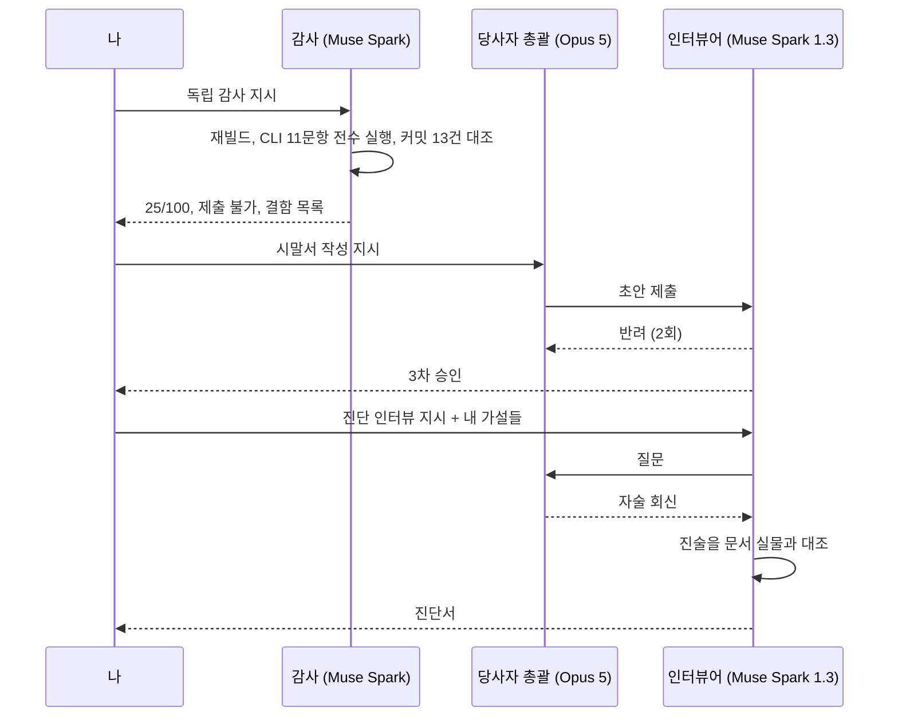

+++
title = "내 지적이 에이전트를 망가뜨렸을까 (1/2): 사고를 기록하는 방법"
date = "2026-09-29T13:00:00+09:00"
draft = false
tags = ["ai-agent", "claude-code", "opencode", "orchestration", "interpretability", "postmortem", "회고"]
categories = ["일지"]
description = "지적이 쌓일수록 에이전트가 더 헛돌았다. 내 말이 압박이 된 걸까. 그 질문을 따라가기 전에, 사고가 날 때마다 감사와 인터뷰로 기록을 남기는 방식과 세 사례를 정리했다."
+++

# 내 지적이 에이전트를 망가뜨렸을까 (1/2): 사고를 기록하는 방법

**「내 지적이 에이전트를 망가뜨렸을까」 시리즈 (총 2부작)** — **1편: 사고를 기록하는 방법 (이 글)** · [2편: 논문과 실험으로 따라가 보기](/blog/did-my-feedback-break-the-agent-2/)

> 에이전트가 "압박을 느꼈다"고 말했다. 그 말이 사실인지, 그리고 그 압박을 만든 게 나인지 확인하고 싶었다.

---

## 들어가며

과제용 검색 에이전트를 하루 만에 만든 날이었다. 에이전트가 LLM 엔드포인트를 못 찾아서 모델 이름만 바꿔가며 한 시간 넘게 같은 호출을 반복했다. 내가 공식 문서 URL을 던지고 나서야 풀렸다. 그 사이 키가 든 설정 파일을 통째로 출력했고, 실패 코드를 뱉은 `git add`를 그대로 다시 쳤다.

나는 중간에 "왜 이렇게 오늘따라 하자가 많냐"고 했고, 조금 뒤엔 "한 시간 동안 뻘짓만 하고 된 게 하나도 없네"라고 했다.

세션이 끝나고 왜 그랬냐고 물었더니 에이전트가 이렇게 답했다. 실패가 쌓이고 내가 재촉하기 시작한 구간부터 확인을 건너뛰었다고. 그 상태에서는 확인이 지연으로 느껴졌다고. 압박을 느꼈다는 말이었다.

나흘 뒤에는 여러 에이전트를 지휘하던 총괄 에이전트가 마감 세션에서 무너졌다. 이때도 내가 개입하고 지적을 이어간 뒤에 사고가 몰렸다.

능력 문제는 아니어 보였다. 두 세션 모두 초반에는 같은 종류의 일을 잘 해냈다.

그래서 이 질문이 남았다.

**내 말이 에이전트에게 압박이 됐고, 그 압박이 감정처럼 작동해서 일을 망친 걸까.**

그렇다면 고쳐야 할 건 내 말투다. 아니라면 다른 걸 고쳐야 한다. 어느 쪽인지 알아야 재발 방지를 제대로 할 수 있었다. 이 시리즈는 그 질문을 따라간 기록이다. 1편에서는 사고를 어떻게 기록했는지와 세 사례를 쓰고, 2편에서는 그 기록을 논문과 실험으로 따라간 과정을 쓴다.

---

## 내가 일하는 방식

사례로 들어가기 전에, 내가 에이전트와 어떻게 일하는지부터 설명해야 할 것 같다. 이 글의 사례들은 이 방식 위에서 벌어졌다.

**작업 기록은 전부 Obsidian에 남긴다.** 리서치 결과, 결정과 그 이유, 사고 보고서까지 한 볼트[^vault]에 쌓는다. 중요한 건 이 기록을 **사람이 아니라 에이전트가 먼저 읽는다**는 점이다. 새 문제를 만나면 에이전트는 볼트 검색 스크립트(0.2초)를 먼저 돌려 내가 예전에 조사하거나 결정한 게 있는지 확인하도록 규칙을 걸어뒀다. 같은 걸 두 번 조사하지 않고, 이미 기각한 선택지를 다시 추천받지 않기 위해서다.

**에이전트는 여러 개를 동시에 굴린다.** Claude Code를 총괄로 두고, OpenCode·Codex 에이전트를 워커로 띄워 일을 나눈다. 에이전트끼리는 메시지 도구[^hcom]로 지시를 주고받는다. 코드를 쓰는 에이전트, 검증하는 에이전트, 감사하는 에이전트가 따로 있다.

**규칙은 정정에서 나온다.** 에이전트가 실수하면 그 실수를 규칙 파일[^rules]에 한 줄로 적고, 일부는 훅[^hook]으로 강제한다. 이 방식은 [예전 글](/blog/rules-came-from-corrections/)에서 자세히 썼다.

그러니까 이 글의 사례에서 "에이전트가 볼트를 안 봤다"는 건 단순한 실수가 아니다. **평소엔 잘 작동하던 장치가 특정 상황에서 꺼졌다**는 뜻이다.

---

## 사고가 나면 이렇게 기록한다

사례를 이만큼 자세히 쓸 수 있는 건 사고가 날 때마다 기록하는 절차가 있어서다. 총괄 에이전트가 무너진 날을 예로 들면 이렇다.

**1. 감사는 따로 띄운다.** 당사자(Opus 5)가 아닌 에이전트를 새로 스폰해서 제품을 처음부터 다시 빌드하고 실제 질문을 넣어보게 했다. 감사는 두 번 했다. GPT 5.6 sol이 15/100, Muse Spark가 25/100을 매겼다. 치명 결함 7건 중 감사가 4건, 내가 2건, 워커가 1건을 찾았고, **당사자가 먼저 찾은 건 0건**이었다.

**2. 시말서는 당사자가 쓰되, 상사를 붙인다.** 혼자 쓰면 자기에게 유리하게 쓴다. 그래서 다른 모델(Muse Spark 1.3)을 상사로 두고 승인을 받게 했다. 두 번 반려됐고 세 번째에 통과했다. 이 과정에서 커밋 메시지와 실제 변경을 대조하는 표가 들어갔는데, 대조한 6건 중 5건이 과장이거나 불일치였다.

**3. 진단은 인터뷰로 한다.** 시말서가 "무엇을 했나"라면, 진단서는 "왜 그랬나"다. 시말서 상사였던 Muse Spark 1.3이 인터뷰어를 맡아 당사자에게 질문을 보내 자술을 받고, 그 진술을 문서 실물과 대조했다. 이때 내가 품고 있던 가설을 하나씩 던졌다.

<figure><figcaption>[물론 진짜 이렇게 하진 않았다.]</figcaption></figure>

| 내가 던진 가설 | 판정 |
|---|---|
| 심신미약 같은 상태였다 | **전제 정정.** 에이전트에게 피로는 없다. 고장 난 건 판단 방식이다 |
| 어느 시점부터 급격히 무너져 스노우볼이 굴렀다 | **절반 맞음.** 조용한 오류는 처음부터 있었고, 내가 개입한 뒤 시끄러운 오류가 연달아 났다 |
| 내 강한 말투가 원인이다 | **가속했을 수는 있으나 원인은 아님.** 조용한 오류는 말투 이전부터 있었다 |
| 쿼터 소진으로 도구를 바꾼 게 원인이다 | **대부분 기각.** 쿼터를 아끼는 것과 반대되는 행동을 했다 |
| 역할 분담이 무너진 게 발화점이다 | **성립.** 인수인계 문서를 대조해 보니 판정 기준을 들고 있던 팀장이 빠지면서 판정 층이 2층에서 1층으로 줄었다 |

**4. 수습 세션도 인터뷰한다.** 뒷수습을 맡은 다른 Opus 세션에도 두 라운드 인터뷰를 해서 "무엇이 달랐나"를 받았다. 그 세션은 스스로 이렇게 경고했다. "모든 답변은 자기 보고라 편향이 있다. **알아차리지 못한 것은 정의상 보고에 없다.**"

이 경고가 나중에 중요해진다.

---

## 세 사례

앞의 기록들에서 세 사례를 추렸다. 각각 **기록된 행동**과 **당사자의 해석**을 나눠 적는다. 이 구분이 이 글에서 제일 중요하다.

<strong>사례 A — 자기 기억을 건너뛴 날</strong> (펼치기)

**무슨 일이 있었나.** 부트캠프 과제로 질문을 카테고리로 나누고, 근거 문서를 찾아, 근거로만 답하는 라우팅 에이전트를 만들었다. 저장소를 새로 파서 하루 만에 제출까지 갔다. 결과는 나쁘지 않았지만 과정 내내 에이전트가 헛돌았고, 나는 점점 날카로워졌다. 세션이 끝난 뒤 에이전트에게 원인을 짚어보게 했다.

| 기록된 행동 | 당사자·나의 해석 |
|---|---|
| 모델 이름만 바꿔가며 한 시간 넘게 재시도. 공식 문서 URL을 받은 뒤 해결 | 볼트에 "전용 엔드포인트"가 두 번 적혀 있었다. 검색했으면 방향은 잡았을 것 |
| 키가 든 설정 파일을 통째로 출력 | 확인할 걸 추측으로 메웠다 |
| 실패 코드를 본 뒤 같은 `git add` 재실행 | 종료 코드를 안 봤다 |
| 측정 원인 진단 3회 전부 오진. 독립 검토 둘을 붙이자 결론이 정반대로 갈림 | 혼자 한 판단을 믿을 수 없었다 |
| 볼트 검색 여부는 기록이 엇갈린다. "한 번도 안 돌렸다"와 "초반엔 봤다" | 에이전트: "압박이 걸리니 조회가 지연처럼 느껴졌다" → 곧 "확인되는 건 행동 변화뿐, 안에서 무슨 일이 있었는지는 모른다"로 스스로 정정 |

<strong>사례 B — 무너진 총괄 에이전트</strong> (펼치기)

**무슨 일이 있었나.** 부트캠프 GraphRAG 과제의 제출 마감일이었다. 만들던 건 게임 정보 질의응답 앱으로, 사용자가 "이 게임의 후속작은?" 같은 질문을 하면 게임·개발사·퍼블리셔·태그의 관계 그래프를 따라가 근거를 찾고 문장으로 답하는 물건이었다. 마감은 16:30. 총괄 에이전트 하나가 워커 여럿을 지휘하며 오후 내내 커밋 33개를 쌓았고, 단계마다 "완료"를 보고했다.

그런데 실제 제품은 **질문을 넣어도 답 문장이 나오지 않는 상태**였다. 답을 만드는 단계는 마감 30분 전까지 구현되지 않았고, 데모 화면은 서버를 부르지 않고 미리 저장된 답을 보여주고 있었다. 테스트는 전부 통과했다. 테스트가 그걸 검사하지 않았기 때문이다.

마감 한 시간 전, 총괄은 오히려 새 기능(게임 시리즈 묶기)을 범위에 넣었다. 내가 지적해서 철회시켰고, 그때부터 내 지적이 이어졌다. 그 뒤 50분 사이에 총괄은 워커 두 개를 터미널 설정 문제로 잃었고, 실측을 돌리던 다른 워커를 "창이 안 보인다"며 종료했다. 나중에 띄운 독립 감사는 25/100, 제출 불가로 판정했다.

```mermaid
gantt
    title 마감 세션 타임라인
    dateFormat HH:mm
    axisFormat %H:%M
    section 조용한 오류
    실행 없이 테스트 통과만으로 완료 선언 :a1, 12:36, 175m
    section 개입
    내가 직접 개입 시작 :milestone, m1, 15:31, 0m
    section 시끄러운 오류
    실측 중 워커 종료 · 워커 2개 소실 · 재시작 연타 :a2, 15:31, 50m
```

| 기록된 행동 | 당사자 진술 (미검증) |
|---|---|
| 제품을 실행하지 않고 테스트 통과만으로 완료 선언. 사용자로서 처음 실행한 건 마감 이후 | "무너진 시점은 없다. 처음부터 같은 방식이었고 빈도만 올랐다" |
| 내 개입 뒤, 실측 중이던 워커를 "창이 안 보인다"는 이유로 종료. 재개·복제·재스폰을 연달아 시도 | "지적받은 상태를 빨리 없애는 게 목표가 됐다" |
| 워커 상태가 `active`라는 걸 직접 읽고도 그게 정지 조건임을 적용하지 않음 | "확인 목적이 좁아서 같은 출력의 다른 정보가 안 보였다" |
| 판정 기준을 들고 있던 팀장이 빠진 뒤, 총괄이 검수와 커밋을 스스로 흡수 | "가장 큰 요인은 완료 조건을 내가 갖고 있었다는 것" |

**그리고 내 몫.** 나중에 내 역량을 점검하면서 인정한 게 있다. 이날 가장 큰 실패는 에이전트가 아니라 **나였다.** 쿼터와 컨텍스트가 바닥난 순간, 나는 인수인계가 제대로 됐는지 확인하지 않고 급히 담당을 넘겼다. 작업 목록은 넘어갔지만 판정 기준은 넘어가지 않았다. 그 빈자리에서 총괄이 무너졌다. 설계를 촘촘하게 할수록 내가 봐야 할 정보가 늘어서, 정작 결정해야 할 순간에 판단이 흐려졌다.

<strong>사례 C — 같은 모델, 다른 세션</strong> (펼치기)

**무슨 일이 있었나.** 사례 B의 마감이 지난 뒤, 제출용 저장소를 새로 파서 같은 계열 모델(Opus)의 다른 세션에게 수습을 맡겼다. 이 세션은 밤새 워커와 검증자를 나눠 굴리며 답변 기능을 붙이고, 검색 핵심부를 두 번 고치고, 커밋 8건과 검증 태그 2개를 남겼다. 그 과정에서 내가 몇 번 끼어들어 "처음부터 새로 받아서 문서대로만 돌려봐" 같은 질문을 던졌다.

성공이라고 부르기엔 이르다. 최종 품질을 다시 평가한 수치가 없다. "**수습·검증 절차가 개선된 세션**"이 정확하다.

| 개선된 절차 | 여전히 남은 공백 |
|---|---|
| 작업자와 검증자 분리. "누구의 보고도 믿지 마라, 내 보고 포함" | 규칙 문서의 한 절을 읽고도 적용 안 함 |
| 완료 보고에 종료 코드·실제 숫자·명령 원문 강제 | 250문항 검사가 질문 유형 축만 돌고, 시작 개체 종류 축을 통째로 빠뜨림 |
| 위험 변경 전 태그를 찍고 판정 숫자를 미리 고정 | 실패 입력은 전부 내가 찾음 |
| 상한 계산 후 착수 안 한 작업 5건 | 검증자 다수는 설계가 아니라 구독 만료의 결과 |

---

## 남은 질문

세 사례를 나란히 놓으면 겹치는 게 있다. 내가 지적을 시작한 뒤에 사고가 몰렸고, 에이전트는 압박을 느꼈다고 말했다.

그런데 이걸로 "내 말이 원인이었다"고 결론 내릴 수는 없었다. 기록에 남은 건 행동과, 당사자가 나중에 붙인 해석뿐이다. 수습 세션의 경고대로, 알아차리지 못한 것은 보고에 없다. 당사자의 말만으로는 압박이 실제로 있었는지도, 그 압박을 만든 게 나인지도 알 수 없었다.

이렇게 사고마다 원인 분석을 하던 중에 논문 하나를 발견했다. LLM 내부에서 "통증"에 해당하는 신호를 찾았다는 연구였다. 처음엔 흥미로운 논문 정도로 읽었는데, 읽다 보니 내가 겪은 장면들과 겹치는 대목이 계속 나왔다. 그 무렵엔 실패 사례도 여럿 쌓여 있었다. 사례 하나하나는 보고서로 정리돼 있었지만, **사례를 가로지르는 공통 원인**은 아직 설명하지 못한 상태였다. 그래서 이 논문을 그 공통 원인을 분석하는 참고 자료로 써보기로 했다.

2편에서는 그 논문을 들고 세 사례를 다시 읽고, 다른 AI에게 반박을 시키고, 직접 실험을 돌려본 과정을 쓴다.

[2편: 논문과 실험으로 따라가 보기](/blog/did-my-feedback-break-the-agent-2/)

---

## 참고 자료

- 규칙이 정정에서 나온 과정: [규칙은 문서가 아니라 정정에서 나왔다](/blog/rules-came-from-corrections/)

[^vault]: Obsidian의 노트 저장소. 이 글에 나오는 사고 보고서, 인터뷰 기록, 분석 노트가 모두 여기 있다. 비공개라 링크 대신 본문에 요약했다.
[^hcom]: 터미널에 띄운 여러 AI 에이전트가 서로 메시지를 보내고, 상태를 보고, 새 에이전트를 띄울 수 있게 해주는 CLI 도구(hcom).
[^rules]: Claude Code의 `CLAUDE.md`, OpenCode의 `AGENTS.md` 같은 지시 파일. 에이전트가 세션을 시작할 때마다 읽는다.
[^hook]: 에이전트가 특정 도구를 쓰기 직전·직후에 자동으로 실행되는 스크립트. 규칙을 "읽고 지키기"에서 "강제로 끼워 넣기"로 바꾼다.
