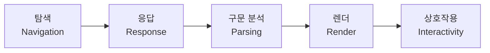

+++
title = "브라우저는 어떻게 화면을 그리는가 1편: 탐색(Navigation)과 응답(Response)"
date = "2026-07-16T13:00:00+09:00"
draft = false
tags = ["browser-internals", "web-performance", "rendering-pipeline", "frontend", "학습노트"]
categories = ["일지"]
description = "URL 입력부터 서버 응답을 받기까지 — 브라우저 동작 원리 4부작 중 1편. DNS 조회, TCP/TLS 연결, HTML 응답까지의 탐색·응답 단계 정리"
+++

> 예전에 노션에 정리해뒀던 "브라우저는 어떻게 동작하는가" 자료를, 최신 기준(Core Web Vitals 개편, 브라우저 엔진 변화 등)에 맞춰 다듬고 살을 붙여 블로그로 옮긴 글이다. 분량이 길어서 4편으로 나눴다.

**브라우저 동작 원리 시리즈 (총 4부작)** — **1편 탐색·응답(이 글)** · [2편 구문 분석](/blog/how-browsers-work-2-parsing/) · [3편 렌더](/blog/how-browsers-work-3-render/) · [4편 상호작용·정리](/blog/how-browsers-work-4-interactivity/)

---

## 굳이 이걸 알아야 할까?

프론트엔드를 하다 보면 한 번쯤 이런 생각이 든다. "브라우저가 어떻게 동작하는지까지 알아야 하나? 그냥 프레임워크 문법만 알면 되는 거 아닌가?"

2017년 Google이 발표한 [모바일 페이지 속도 벤치마크](https://www.thinkwithgoogle.com/intl/en-ca/marketing-strategies/app-and-mobile/mobile-page-speed-new-industry-benchmarks/) 조사 결과를 보면 생각이 좀 달라진다. 로딩 시간이 늘어날수록 이탈 확률(Probability of Bounce)이 이렇게 뛴다.



거의 10년이 지난 지금은 디바이스와 브라우저 성능이 훨씬 좋아졌지만, 그만큼 웹사이트의 복잡도와 규모도 같이 커졌다. "체감 성능을 어떻게 개선할까"라는 질문에 다양한 개발 포럼과 문서들이 입을 모아 하는 말이 있다. **실제 성능이든 체감 성능이든, 개선하려면 먼저 브라우저가 뭘 하고 있는지부터 알아야 한다는 것.**

## 시작 전에: 브라우저는 기본적으로 싱글 스레드다

브라우저에서 일어나는 상호작용 처리, 렌더링, 페인트 같은 작업 대부분은 **메인 스레드(Main Thread)** 하나에서 처리된다. 은행 창구가 하나인데 대기 인원이 100명인 상황을 떠올리면 된다. 처리할 일(Stack)이 많아질수록 소요 시간은 그만큼 길어진다.

문제는 줄 선 인원만이 아니다. 실행 시간이 오래 걸리거나 무한 루프에 빠진 JavaScript 함수가 있으면, 그걸 처리하는 동안 메인 스레드 전체가 막혀서 페이지 응답이 늦어진다. 그래서 렌더링·페인팅 과정을 단계별로 쪼개거나, SSR·Lazy Loading·SSG 같은 방식으로 메인 스레드 부하를 줄이는 게 곧 성능 최적화로 이어진다.

> JavaScript의 Call Stack, Task Queue, Event Loop 같은 동작 방식은 이 글의 범위 밖이다. 브라우저 동작 원리 못지않게 중요한 주제라 따로 다룰 만한 가치가 있지만 여기선 다루지 않는다.

## 전체 그림 먼저

브라우저가 URL 하나를 받아서 화면에 상호작용 가능한 페이지를 띄우기까지, 크게 다섯 단계를 거친다.

이 중 **Render Tree · Layout · Painting**을 묶어 **중요 렌더링 경로**(CRP: Critical Rendering Path)라고 부른다. 브라우저가 HTML·CSS·JavaScript를 화면의 픽셀로 바꾸는 핵심 경로라는 뜻이다.

")

이 시리즈는 이 다섯 단계를 하나씩 순서대로 뜯어본다. 이번 편은 그중 **탐색**과 **응답** 두 단계다.

---

## 1단계: 탐색(Navigation)

사용자가 URL을 입력하거나 링크를 클릭해서 뭔가를 "요청"하는 순간, 가장 먼저 시작되는 과정이다.

### DNS 조회

브라우저는 요청받은 URL의 자원이 어디 있는지 알아내야 한다. 이를 위해 Name Server에 DNS 조회를 요청하고, Name Server는 그 자원이 위치한 IP 주소를 돌려준다. 한 번 조회한 IP 주소는 일정 시간 캐시되기 때문에, 같은 호스트를 다시 조회할 때는 이 과정이 생략된다.

여기서 놓치기 쉬운 포인트 — **DNS 조회는 보통 호스트 이름 하나당 한 번** 일어난다. 그런데 한 페이지가 여러 도메인(CDN, 광고 스크립트, 분석 도구, 폰트 서비스 등)의 자원을 동시에 참조한다면, **그 호스트 개수만큼 DNS 조회를 반복**해야 한다는 뜻이다.

이후 네트워크 연결 세션을 여는 TCP(Transmission Control Protocol) Handshake, 통신 구간을 암호화하는 TLS(Transport Layer Security) Negotiation 과정을 거친다. 이 부분은 이 글에서는 깊게 다루지 않는다. 더 알고 싶다면 [MDN의 브라우저 동작 순서(탐색)](https://developer.mozilla.org/ko/docs/Web/Performance/How_browsers_work#탐색navigation) 문서를 참고하면 된다.

> **업데이트 포인트**: 위 다이어그램은 ClientHello → ServerHello&Certificate → ClientKey → Finished, 왕복이 여러 번 도는 **TLS 1.2** 기준 흐름이다. 지금 표준인 **TLS 1.3**(2018, RFC 8446)은 이 협상을 왕복 1회(1-RTT)로 줄였고, 이미 연결해본 적 있는 서버라면 0-RTT로 더 빠르게 재개할 수도 있다. 대부분의 최신 브라우저·서버가 TLS 1.3을 기본으로 쓰므로, 실제 체감 연결 수립 시간은 이 그림보다 짧은 경우가 많다.

### 실측: 첫 방문 vs 재방문

실제 Chrome DevTools 캡처로 비교하면 차이가 뚜렷하다.

, Initial connection(64.37ms), SSL(60.28ms)까지 전부 거친다")

첫 진입에서는 DNS 조회, 연결 초기화, SSL 협상을 모두 거치지만, 캐시가 만료되기 전 같은 경로로 재진입하면 이 과정이 통째로 생략된다. 한 페이지가 여러 도메인의 자원을 쓸수록 이 지연이 도메인 개수만큼 누적된다는 걸 이 캡처 하나로도 체감할 수 있다.

### 호텔 체크인에 비유하면

| 탐색 단계        | 호텔 체크인                                                                               |
| ---------------- | ----------------------------------------------------------------------------------------- |
| DNS 조회 요청    | 숙박객이 프론트에 원하는 객실 안내를 요청                                                 |
| Name Server 응답 | 프론트 직원이 층수·호실을 안내 (IP 주소 회신)                                             |
| TCP Handshake    | 이용 안내·부대시설 설명·문의응답 (연결 매개변수 협상)                                     |
| TLS Negotiation  | 신원 확인 후 열쇠 수령, 주의사항 안내 (암호화된 연결 수립)                                |
| 이후             | 체크아웃까지는 매번 이 절차를 반복할 필요 없이 자유롭게 왕래 (캐시 유효 기간 동안 재사용) |

이 탐색 과정을 모두 지나면 브라우저는 실제 **요청**(Request)을 보낸다.

---

## 2단계: 응답(Response)

서버와의 연결이 성립되면 브라우저는 `HTTP GET Request`를 보낸다. 요청을 받은 서버는 이를 처리해서 Response Header와 Response Data를 돌려준다.

### HTML 마크업이 먼저 오는 이유

연결이 성립되자마자 가장 먼저 요청되는 건 CSS나 JavaScript가 아니라 **순수 HTML 문서(Document)** 데이터다. 실제 Network 탭을 보면 대부분의 사이트가 document 타입부터 로드하는 걸 확인할 수 있다.

CSS·JavaScript 같은 다른 자산들은 **HTML이 모두 다운로드된 후, 구문 분석 과정에서** 요청된다. 이유는 간단하다 — 브라우저는 HTML 문서를 분석해야 비로소 "이 문서가 어떤 자원을 참조하고 있는지" 알 수 있기 때문이다. CSS나 JS 파일 경로를 HTML 마크업 문법에 맞춰 넣는 것도 이래서다. 이렇게 HTML에 종속되어 요청되는 자원들의 흐름을 **Request Initiator Chain**이라고 부른다.

### 구문 분석 전에 알아두면 좋은 용어

- **TTFB(Time to First Byte)**: 브라우저가 최초 요청을 보내고 HTML의 첫 패킷(청크)을 받기까지 걸리는 시간. DNS 조회, TCP·TLS 연결 수립 시간까지 전부 포함된다.
- **TCP 슬로우 스타트**: 첫 응답 패킷은 보통 14KB 정도의 작은 크기로 온다. 이 첫 청크에 대한 응답 속도를 보고 네트워크 상태를 가늠하면서, 이후 전송량을 점진적으로 늘려간다.

---

다음 편에서는 이렇게 받은 HTML 응답을 브라우저가 실제로 어떻게 "이해"하는지 — DOM·CSSOM 생성과 구문 분석 과정을 본다.

**다음 편 →** [2편: 구문 분석(Parsing)](/blog/how-browsers-work-2-parsing/)
