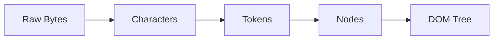

+++
title = "브라우저는 어떻게 화면을 그리는가 2편: 구문 분석(Parsing)"
date = "2026-07-16T13:05:00+09:00"
draft = false
tags = ["browser-internals", "web-performance", "rendering-pipeline", "frontend", "학습노트"]
categories = ["일지"]
description = "브라우저 동작 원리 4부작 중 2편. HTML을 DOM으로, CSS를 CSSOM으로 바꾸는 구문 분석 과정과 프리로드 스캐너, async/defer, JS 컴파일까지"
+++

**브라우저 동작 원리 시리즈 (총 4부작)** — [1편 탐색·응답](/blog/how-browsers-work-1-navigation-response/) · **2편 구문 분석(이 글)** · [3편 렌더](/blog/how-browsers-work-3-render/) · [4편 상호작용·정리](/blog/how-browsers-work-4-interactivity/)

지난 편에서 브라우저가 서버로부터 첫 HTML 청크를 받는 데까지(탐색·응답)를 다뤘다. 이번 편은 그렇게 받은 HTML을 브라우저가 실제로 "이해"하는 구문 분석 단계다.

---

## 3단계: 구문 분석(Parsing)

응답 단계에서 첫 HTML 청크를 받은 브라우저는 이제 이걸 **DOM**(Document Object Model)과 **CSSOM**(CSS Object Model)으로 바꾸기 시작한다. 이 둘은 다음 단계인 렌더에서 화면을 그릴 때 그대로 쓰인다.

### 브라우저가 이해할 수 있는 형태로: 사전 과정


HTML 데이터를 받았다고 바로 구문 분석이 시작되는 건 아니다. 몇 단계 사전 처리를 거쳐야 한다.

1. TCP 슬로우 스타트 방식으로 전송되는 HTML 데이터는 여러 청크로 나뉘어 도착한다.
2. 청크들이 모두 도착하면 이를 머지한다.
3. 머지된 데이터는 아직 원시 바이트(Raw Bytes) 상태라 브라우저가 이해할 수 없다. 이를 문자(Character)로 변환한다.
4. 변환된 문자열을 HTML 마크업 문법에 맞춰 토큰(Token)으로 쪼갠다.
5. 토큰들이 모여 노드(Node)가 되고, 노드들이 트리 구조로 연결되며 DOM이 만들어진다.



### DOM 생성 — 토큰과 노드는 다른 개념이다

| 구분  | 의미                                                                             |
| ----- | -------------------------------------------------------------------------------- |
| Token | HTML 태그에 대한 구문 분석 단위. `<div>`, `<p>`처럼 꺾쇠 괄호로 묶인 문자열 정보 |
| Node  | 토큰을 기반으로 변환된 개별 개체이자 DOM 트리를 구성하는 실제 요소               |


DOM 트리는 이 노드들을 트리 형태로 연결한 구조이며, 노드 간의 관계·계층·속성·콘텐츠를 모두 포함한다. HTML 문서의 ROOT는 `<html>` 요소다. `<html>`로 시작해 `</html>`로 닫는 이유가 바로 이것이다. 그 아래 `<head>`와 `<body>`는 `<html>`의 자식(child) 노드고, 서로는 형제(sibling) 노드다.

아래의 이미지는 보다 더 복잡하고 계층이 깊은 노드 트리이다.

")

**DOM 트리 구축 시간에 영향을 주는 요소들:**

- HTML 마크업 태그의 개수
- 마크업 계층 깊이
- 별도 로드 속성이 없는 `<script>` 요소

`<script>`만 유독 문제가 되는 이유는, JavaScript로 DOM 요소를 추가·삭제·제어하는 경우가 흔하기 때문이다. 트리가 다 만들어지기 전에 스크립트가 끼어들면 구조 충돌 가능성이 커진다. 그래서 문서 중간에 `<script>`가 나오면 **구문 분석이 그 시점에 멈추고(Blocking)**, 스크립트 실행이 끝난 뒤에야 분석이 재개된다. 이런 케이스가 많아질수록 병목이 커지는데, 이걸 막는 방법이 뒤에서 다룰 `async`/`defer`다.

### CSSOM 생성

DOM 생성이 끝나면 CSSOM을 만든다. CSSOM은 "CSS의 DOM 버전"이라고 생각하면 된다. DOM이 콘텐츠 정보를 담은 모델이라면, CSSOM은 그 콘텐츠를 스타일링하기 위한 모든 스타일 정보를 담은 모델이다. 다만 만들어지는 방식은 다르다.

|           | DOM                                              | CSSOM                                              |
| --------- | ------------------------------------------------ | -------------------------------------------------- |
| 담는 정보 | 웹페이지의 콘텐츠 정보                           | 문서를 스타일링하기 위한 스타일 정보               |
| 생성 방식 | 문자 → 토큰 → 노드 → 노드 트리로 점진적으로 생성 | CSS 선택자 기반, **상위에서 하위로 종속**되며 생성 |

CSSOM은 UserAgent 스타일(브라우저 기본 스타일)도 포함한다. CSS 작업자들이 스타일시트를 작성하기 전에 Reset이나 Normalize를 하는 이유가 여기서 나온다.

> CSS 구문 분석 자체에 드는 리소스는 크지 않다. CSS를 깔끔하게 정의해야 하는 진짜 이유는 CSSOM 생성 속도 때문이 아니라, 뒤에서 다룰 **Cascade 규칙**에 따라 의도한 스타일이 정확히 적용되게 하기 위해서다.

### 연결 자산 로딩 — 프리로드 스캐너

DOM·CSSOM 생성은 메인 스레드에서 순차 처리된다. 그렇다면 구문 분석 도중 ``, `<link>`, `<script>` 같은 연결 자산도 하나씩 순서대로 요청해야 할까? 그렇게 하면 자산을 요청·응답받는 동안 구문 분석이 매번 멈춰야 하고, DOM 생성 시간이 기하급수적으로 늘어난다.

이를 막기 위해 등장한 게 **프리로드 스캐너**(Preload Scanner)다. HTML 데이터가 토큰으로 변환되는 시점부터, 메인 스레드와는 별개로 ``, `<link>`, `<script>` 등 연결 자산 토큰을 스캔하고, 그 자산들의 요청·다운로드를 메인 스레드 밖에서 병렬로 진행한다. 이 덕분에 구문 분석과 자산 로딩이 동시에 진행되면서 블로킹이 크게 줄어든다.

```html
<link rel="stylesheet" src="styles.css" /> 
```

문제는 JavaScript다. DOM 구조를 바꿀 가능성이 있는 `<script>`는, 별도 로드 속성이 없다면 프리로드 스캐너에서도 예외 없이 분석을 블로킹한다. 예전에는 `<script>`를 문서 맨 뒤에 두는 식으로 이걸 회피했지만, 지금은 `async`와 `defer` 속성으로 더 명확하게 제어할 수 있다.

```html
<script src="myscript.js" async></script>
<script src="anotherscript.js" defer></script>
```

두 속성의 차이를 타임라인으로 보면 이렇다.

```mermaid
gantt
    dateFormat X
    axisFormat %L
    section HTML 파싱
    파싱 계속 진행 : active, parse, 0, 100
    section async 스크립트
    다운로드 (파싱과 병렬) : dl_a, 10, 40
    실행 (파싱 즉시 중단) : crit, exec_a, 40, 55
    section defer 스크립트
    다운로드 (파싱과 병렬) : dl_d, 15, 60
    실행 (파싱 끝난 후) : crit, exec_d, 100, 115
```



| 속성    | 동작                                                                         |
| ------- | ---------------------------------------------------------------------------- |
| `async` | 다운로드는 파싱과 병렬로 진행. 다운로드가 **끝나는 즉시** 파싱을 멈추고 실행 |
| `defer` | 다운로드는 파싱과 병렬로 진행. **모든 구문 분석이 끝난 후** 순서대로 실행    |

")

다만 이 둘이 만능은 아니다. `src` 속성이 없는 인라인 스크립트에는 `async`/`defer` 둘 다 적용되지 않는다. 인라인 스크립트를 만나면 브라우저는 예외 없이 그 자리에서 구문 분석을 멈추고 실행부터 마친다.

> **놓치기 쉬운 지점 — CSS도 사실 차단재다.** CSS 자체는 DOM 파싱을 막지 않지만, **CSSOM이 완성되기 전까지는 이후에 오는 스크립트 실행이 대기한다.** 스크립트가 스타일 정보(computed style)를 참조할 가능성이 있기 때문이다. 그래서 `<head>`에 넣은 대형 CSS 파일은 화면 자체는 물론 그 뒤 스크립트 실행 타이밍에도 영향을 준다. `<link rel="stylesheet">`를 문서 상단에, `<script>`는 되도록 `defer`로 하단 로직과 분리하라는 가이드가 여기서 나온다.

### JS 컴파일과 접근성 트리 구축

구문 분석의 마지막 단계다. MDN은 이 두 작업을 묶어 "다른 작업들(Other Processes)"이라고 부른다.

**JavaScript 컴파일** — 디바이스는 JavaScript를 직접 이해하지 못한다. 브라우저에 내장된 **JavaScript 엔진**(ECMAScript 엔진)이 이를 바이트코드로 컴파일해야 실행할 수 있다. 브라우저마다 쓰는 엔진이 다르다.

| 엔진               | 특징                                                                                                                            |
| ------------------ | ------------------------------------------------------------------------------------------------------------------------------- |
| **V8**             | Google이 만든 엔진. Chrome, Node.js, 그리고 2020년 이후 Chromium 기반으로 전환한 **Microsoft Edge**에서도 사용된다. C++로 작성. |
| **JavaScriptCore** | WebKit에 내장된 엔진. macOS의 Safari, Mail 등에서 사용. `SquirrelFish`라는 별칭으로도 불린다.                                   |
| **SpiderMonkey**   | Mozilla의 엔진. Firefox 등에서 사용되며 C++, JavaScript, Rust로 작성.                                                           |

> **업데이트 포인트**: 원래 노션 자료에는 Microsoft의 자체 엔진 **Chakra**도 나란히 있었지만, Microsoft Edge는 2020년 1월부터 Chakra 대신 **Chromium 기반**(V8 엔진)으로 전면 전환했다. 지금은 4대 데스크톱 브라우저 엔진이 사실상 **Blink(Chrome/Edge) · WebKit(Safari) · Gecko(Firefox)** 셋으로 좁혀졌다는 점도 같이 알아두면 좋다. (V8·JavaScriptCore·SpiderMonkey는 각 엔진 안에 포함된 "JS 실행" 부분이고, Blink·WebKit·Gecko는 레이아웃·렌더링까지 포함하는 브라우저 엔진 전체를 가리킨다 — 이 둘을 같은 레벨로 놓고 헷갈리기 쉽다.)

**접근성 트리 구축(Building the Accessibility Tree)** — DOM과 비슷하게 생겼지만 시각적 정보는 배제하고 의미(Semantic) 정보만 담은 **접근성 트리**(Accessibility Tree)가 만들어진다. 스크린 리더 같은 보조기술이 참조하는 트리다. 존재 목적이 DOM과 다르기 때문에 별도로 구축되며, 스크립트가 DOM을 변경·업데이트하면 이 트리도 그에 맞춰 같이 갱신된다.

")

> **업데이트 포인트**: 원래 노션 자료와 위에서 인용한 2016년 web.dev 글은 이 트리를 **AOM**(Accessibility Object Model)이라고 불렀는데, 엄밀히는 살짝 다른 개념이다. 지금은 이 구조 자체를 그냥 **접근성 트리**라고 부르고, "AOM"은 W3C가 별도로 제안한 — 접근성 정보를 JavaScript로 직접 읽고 조작하게 해주는 API 스펙의 이름으로 쓰인다. 트리 자체와 그걸 다루는 API를 같은 이름으로 부르면서 생긴 오래된 혼용이다.

---

다음 편에서는 이렇게 만들어진 DOM과 CSSOM을 실제 화면에 그리는 렌더 단계 — 스타일, 레이아웃, 페인트, 합성을 본다.

**← 이전 편** [1편: 탐색·응답](/blog/how-browsers-work-1-navigation-response/) · **다음 편 →** [3편: 렌더(Render)](/blog/how-browsers-work-3-render/)
