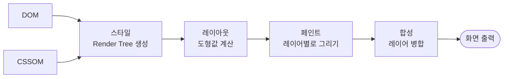
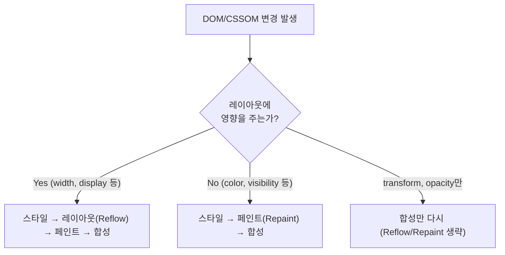

+++
title = "브라우저는 어떻게 화면을 그리는가 3편: 렌더(Render)"
date = "2026-07-16T13:10:00+09:00"
draft = false
tags = ["browser-internals", "web-performance", "rendering-pipeline", "frontend", "학습노트"]
categories = ["일지"]
description = "브라우저 동작 원리 4부작 중 3편. 스타일, 레이아웃, 페인트, 합성 — DOM과 CSSOM이 실제 화면 픽셀로 바뀌는 렌더 파이프라인과 Reflow/Repaint 최적화 원리"
+++

**브라우저 동작 원리 시리즈 (총 4부작)** — [1편 탐색·응답](/blog/how-browsers-work-1-navigation-response/) · [2편 구문 분석](/blog/how-browsers-work-2-parsing/) · **3편 렌더(이 글)** · [4편 상호작용·정리](/blog/how-browsers-work-4-interactivity/)

지난 편에서 브라우저가 HTML·CSS를 DOM·CSSOM으로 바꾸는 구문 분석 과정을 다뤘다. 이번 편은 그 DOM과 CSSOM을 실제 화면에 그리는 렌더 단계다.

---

## 4단계: 렌더(Render)

구문 분석으로 만들어진 DOM과 CSSOM을 실제 화면에 그리는 과정이다. 렌더 과정은 브라우저에서 리소스를 많이 차지하는 구간이라, 웹페이지 성능에 직접 영향을 준다. 많은 프론트엔드 프레임워크·라이브러리가 렌더 프로세스 최적화에 공을 들이는 이유다.

렌더는 **스타일 → 레이아웃 → 페인트 → 합성**, 네 단계를 거친다.

### 리렌더링, 그리고 왜 최소화해야 하는가

DOM 일부가 삭제·수정되는 등 변동 사항이 생기면 렌더 프로세스가 화면을 다시 업데이트하는데, 이걸 **리렌더링**이라 부른다. 문제는 변경된 부분의 영향을 받는 요소들에 대해, **렌더 프로세스의 첫 단계부터 다시** 훑는다는 점이다. 리소스 소모가 큰 구간을 반복해서 도는 셈이라, 불필요한 리렌더링이 잦으면 화면이 버벅이거나(Jank) 예상치 못한 레이아웃 변경이 생겨 사용자 경험에 직접 타격을 준다.

_출처: web.dev(2022) — 이런 불안정한 레이아웃이 CLS(Cumulative Layout Shift) 점수를 깎아먹는 주범이다._

### 스타일(Style) — Render Tree 생성

렌더 트리(계산된 스타일 트리라고도 부른다)는 DOM(콘텐츠)과 CSSOM(스타일)을 결합해 만들어진다.

1. DOM 트리 ROOT부터 시작해 **가시적인 DOM 노드**를 순회하며, 관련된 CSSOM 노드들을 모두 매치한다.
2. 매치된 CSSOM 노드들의 스타일 정의를 전부 대조한다.
3. CSS의 **Cascade 규칙**에 따라 최종적으로 보여질 스타일을 계산한다.

렌더 트리에서 제외되는 비가시성 노드는 `<head>`와 그 자식, `<script>` 요소, `display: none`이 지정된 요소다. 반대로 **비가시성처럼 보이지만 실제로는 렌더 트리에 포함되는** 함정 케이스도 있다 — `visibility: hidden`, `opacity: 0`처럼 스타일로 "안 보이게" 처리된 요소들은 화면엔 안 보여도 렌더 트리엔 들어간다(그래서 레이아웃 공간을 차지한다).

**Cascade(종속) 규칙**은 다음 순서로 적용된다.

1. 적용된 스타일 정의들을 가중치 순으로 정렬
2. 같은 속성이 중복되면 선택자 가중치가 더 높은 쪽이 덮어씀
3. 인라인 `style` 속성은 CSS 파일 정의보다 무조건 우선
4. `!important`는 가중치와 인라인 스타일까지 전부 무시하고 최우선 적용
5. 가중치가 같다면 나중에 정의된 값이 덮어씀 (`!important`도 동일)

### 레이아웃(Layout) — 도형값 계산

렌더 트리 기반으로 각 노드의 **도형값**(너비 `width`, 높이 `height`, 위치 `position`)을 계산하는 단계다. 브라우저는 ROOT부터 하위까지 계층적으로 순회하며 픽셀 단위로 이를 계산한다.

레이아웃 알고리즘은 형제·부모·조상 노드에 정의된 박스 모델 속성과 상호작용하며 도형값을 결정한다. 영향을 주는 요소는 크게 셋이다.

- **박스 모델 속성**: 콘텐츠 영역(`box-sizing`에 따라 기준이 달라짐), 패딩, 보더, 마진 영역
- **레이아웃 모드**: 블록, 인라인, 테이블, 위치 지정, 플렉서블, 그리드
- **뷰포트**: 너비와 방향(가로/세로)

단순하게 정리하면: **도형값은 조상에서 부모로 종속적으로 내려가며, 가장 가까운 직속 부모의 영향력이 제일 크다.** DOM 노드 수가 많고 계층이 깊을수록 렌더 트리도 커지고, 도형값 계산량은 그만큼 기하급수적으로 늘어난다.

화면 렌더링이 끝난 후에도 DOM이 조작되거나 뒤늦게 로드된 이미지 때문에 기존 노드의 도형값과 차이가 생기면, 영향받는 노드들의 도형값을 다시 계산한다. 이를 **리플로우**(Reflow)라고 한다.

### 페인트(Paint)

레이아웃 트리의 노드들은 이제 픽셀 단위 도형값을 갖고 있다. 이 도형값과 정의된 스타일·이미지 등 모든 시각 요소를 실제 화면에 그리는 과정이 페인팅이다. 페인팅은 요소 특성에 따라 **레이어 단위**로 나뉘어 진행된다(레이어 개념은 바로 다음 합성 단계에서 다룬다).

성능 측정에서 중요한 두 지표가 여기서 나온다.

- **FCP(First Contentful Paint)**: 페이지 로드 중 최초로 화면에 콘텐츠가 그려지는 시점
- **LCP(Largest Contentful Paint)**: 현재 화면에서 가장 크게 자리한 텍스트나 이미지 요소가 그려지는 시점

렌더링과 페인팅은 한 번에 끝나지 않는다. 요소의 중요도나 리소스 용량 같은 조건에 따라 부분적·순차적으로 진행된다. 그래서 FCP가 찍힌 프레임에도 화면 일부만 보이는 경우가 흔하고, 이후 타임라인에서 레이아웃과 텍스트가 먼저 렌더되고 이미지가 순차적으로 뒤따르는 패턴을 볼 수 있다.

_출처: web.dev, "First Contentful Paint"(2019)_

> **업데이트 포인트**: 노션 원본에는 "FCP와 LCP가 Web Vitals Performance의 핵심(Core) 기준"이라고 되어 있었는데, 정확히 하자면 **Core Web Vitals(2024년 3월 개편 기준)는 LCP · INP(Interaction to Next Paint) · CLS(Cumulative Layout Shift) 세 가지**다. FCP는 Core Web Vitals가 아니라 Lighthouse가 측정하는 **보조(진단용) 성능 지표**에 속한다. LCP만 진짜 "코어"고, FCP는 그 앞 단계를 보여주는 참고 지표로 이해하는 게 더 정확하다.

### 합성(Compositing)

페인트 단계에서 나뉜 레이어들을 하나로 합치는 과정이다.

중첩되거나 반투명한 요소를 표현하기 위해 가상의 Z축을 기준으로 한 **스태킹 콘텍스트(Stacking Context)** 개념이 있고, 여기 쌓이는 요소들을 **레이어**(Layer)라고 부른다. 이미지 편집 프로그램의 레이어와 같은 개념이다. `position: sticky`로 네비게이션을 고정하거나, 모달을 화면 중앙에 띄우거나, 이미지 위에 텍스트를 얹는 스타일을 짜본 적이 있다면 이미 이 개념을 무의식중에 다뤄본 셈이다.

_출처: MDN, [스태킹 콘텍스트 이해하기](https://developer.mozilla.org/ko/docs/Web/CSS/CSS_positioned_layout/Understanding_z-index/Stacking_context)_

레이어는 스태킹 콘텍스트 조건을 만족하면 자동으로 분리·생성되는데, 이 과정을 **Layerize**라고 한다. 이렇게 분리된 레이어 중 일부는 메인 스레드가 아니라 **GPU**로 넘어가 별도로 처리되기도 한다. (`will-change`, `transform`, `opacity` 애니메이션이 메인 스레드를 안 막고 부드럽게 도는 이유가 여기 있다.)

메인 스레드가 여기까지 만든 레이어 정보를 **컴포지터 스레드**(Compositor Thread)로 넘겨주는 시점을 **Commit**이라 부른다. 이 핸드오프 덕분에 메인 스레드는 곧바로 다음 프레임 작업으로 넘어갈 수 있다. 실제로 레이어들을 픽셀 단위로 겹쳐 최종 화면을 완성하는 건 그 이후 컴포지터 스레드가 GPU와 함께 처리하는 몫이다 — 이때 스타일이 겹치거나 충돌하면 브라우저가 스태킹 콘텍스트 규칙과 CSS Cascade 규칙에 따라 **스스로 계산해서** 최종 순서를 결정한다.

_Chrome DevTools Performance 패널로 직접 측정한 Layerize/Commit 구간._

지금까지 렌더 4단계(스타일 → 레이아웃 → 페인트 → 합성)를 정리하면, DOM/CSSOM 변경이 어느 단계까지 다시 타는지가 최적화의 핵심이다.

`width`나 `display` 같은 속성을 바꾸면 레이아웃부터 다시 돌아야 하지만(Reflow), `color`처럼 도형값에 영향 없는 속성은 페인트부터만 다시 하면 된다(Repaint). `transform`이나 `opacity`처럼 합성 단계만으로 처리 가능한 속성은 레이아웃·페인트를 건너뛰고 GPU에서 합성만 다시 하기 때문에 훨씬 저렴하다. 애니메이션을 짤 때 `top/left` 대신 `transform: translate()`를 권장하는 이유가 바로 이 그림 한 장에 들어 있다.

---

다음 편에서는 화면에 그려진 페이지와 사용자가 실제로 상호작용하는 마지막 단계, 그리고 전체 시리즈를 관통하는 최적화 요약표를 정리한다.

**← 이전 편** [2편: 구문 분석](/blog/how-browsers-work-2-parsing/) · **다음 편 →** [4편: 상호작용·정리](/blog/how-browsers-work-4-interactivity/)
