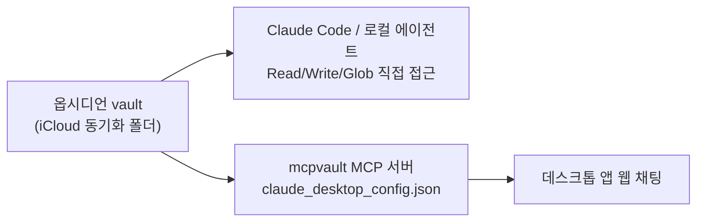

+++
title = "로컬 MCP는 왜 웹 채팅에서 안 열리는가: 옵시디언 vault 연결 삽질기"
date = "2026-07-20T10:00:00+09:00"
draft = false
tags = ["obsidian", "mcp", "claude-code", "claude-desktop", "architecture"]
categories = ["일지"]
description = "옵시디언 vault를 연결하려고 API, 파일시스템 MCP를 차례로 걷어내다가 결국 로컬과 웹은 아예 다른 방식을 써야 한다는 걸 깨달은 하루."
+++

# 로컬 MCP는 왜 웹 채팅에서 안 열리는가

옵시디언 vault 연결 삽질기

> 설정을 세 번 갈아엎고 나서야 깨달았다. 문제는 설정이 아니라 애초에 "될 수 없는 구조"였다는 것.

---

## 들어가며

옵시디언(Obsidian)[^1] vault를 AI 코딩 도구에 연결해서 쓴 지는 꽤 됐다. 그런데 기존에 쓰던 MCP 커넥터(`mcp-obsidian`)가 자꾸 오류를 뱉기 시작했다. 어디가 문제인지 원인을 파고드는 대신, 이번 기회에 아예 연결 방식을 다시 잡기로 했다.

목표는 단순했다. **에러 없이, 가볍게, 로컬 코딩 도구와 데스크톱 앱 양쪽에서 다 되게.** 그런데 이 "양쪽에서 다"가 하루 종일 발목을 잡았다.

[^1]: 마크다운 파일로 메모를 관리하는 앱. vault는 그 메모들이 모여 있는 폴더를 가리키는 옵시디언 용어다.

---

## 1. MCP를 걷어내고 API로

첫 시도는 단순했다. 문제가 있는 MCP 커넥터를 지우고(`claude mcp remove obsidian`), 옵시디언의 Local REST API 플러그인에 직접 HTTP로 붙는 방식으로 바꿨다.

API 키와 URL은 채팅에 그대로 남기지 않고 `~/.config/obsidian-api.env` 파일(권한 600, 소유자만 읽기)에 따로 저장했다.[^2] curl로 찔러보니 바로 `200 OK` — 여기까진 순조로웠다.

[^2]: 대화 중에 API 키가 평문으로 오갔더라도, 그걸 그대로 영구 메모리 파일에 박아두면 이후 모든 세션에 그 값이 로드된다. 노출 범위를 줄이려면 키는 별도 파일에, 메모리에는 "키는 이 경로에 있다"는 참조만 남기는 게 낫다.

---

## 2. API도 필요 없다, 그냥 폴더인데

그런데 다시 생각해보니 API까지 갈 필요가 없었다. 

내 현재 환경에서 옵시디언 vault는 iCloud로 동기화되는 **그냥 로컬 폴더**다. 그러니 굳이 클라우드까지 액세스할 필요 없이 내 로컬 파일시스템에 직접 접근하는 MCP 서버(`@modelcontextprotocol/server-filesystem`)를 붙이는 게 더 직접적이었다.

데스크톱 앱 설정 파일(`claude_desktop_config.json`)에 이 서버를 등록하고, vault 경로를 인자로 넘겼다. Claude Code 세션에서 테스트해보니 문제없이 붙었다 — 로그에도 에러 하나 없었다.

그런데 "다른 데서도 되나" 확인해보라니까 문제가 터졌다. 데스크톱 앱의 **일반 채팅**에서는 이 커넥터를 아예 못 쓰겠다는 거였다.

---

## 3. 로그는 멀쩡한데 왜 안 되지

근데 이상했다.

서버 로그(`~/Library/Logs/Claude/mcp-server-obsidian-vault.log`)를 다시 열어봐도 초기화 성공, 툴 목록 응답까지 전부 정상이었다. 에러가 없는데 안 된다는 건, 설정이 아니라 애초에 **구조적으로 안 되는** 상황이라는 뜻이었다.

정리하면 이렇다.

- 로컬 stdio MCP 서버는 사용자의 맥북에서 뜨는 프로세스다.
- 일반 채팅(웹 기반)은 클라우드에서 돈다.
- 클라우드가 남의 맥북에 떠 있는 프로세스를 실행하거나 통신할 방법은 원천적으로 없다.

즉 일반 채팅은 원격/클라우드 커넥터만 붙일 수 있고, 로컬 MCP는 로컬에서 실행되는 Claude Code 세션 같은 데서만 닿는다. 설정 파일에 `remoteToolsDeviceName` 같은 필드가 있는 걸 보면 로컬 도구를 원격으로 연결해주는 별도의 페어링 구조가 있는 것 같긴 한데, 최소한 순수 stdio MCP를 그대로 얹는 접근으로는 웹 채팅에 닿지 않았다.

---

## 4. 표면(surface)마다 다르게 가기로

여기서 방향을 바꿨다. 하나의 커넥터로 다 해결하려는 대신, 표면별로 다른 방식을 쓰기로 했다.

**코드 쪽(Claude Code / 로컬 에이전트 세션)**: MCP 자체를 걷어냈다. Claude Code는 어차피 로컬 파일에 이미 접근할 수 있는데, 굳이 별도 프로세스를 하나 더 띄워서 그걸 흉내 낼 이유가 없었다. Read/Write/Edit/Glob/Bash 같은 기본 도구로 vault 경로에 바로 접근하는 쪽이 가장 가볍고, 서버가 죽을 일도 없다.

**웹 채팅 쪽**: 로컬 파일에 닿을 방법이 없으니 커넥터가 필요하다. 여기서는 OpenCode에서 이미 쓰던 `mcpvault`[^3]를 그대로 가져와 데스크톱 설정에 등록했다. 이 녀석도 어쨌든 MCP긴 하지만 기본 옵시디언 MCP 커넥터에 비하면 훨씬 가벼웠다.

하, 그런데 또 중간에 한 번 더 클로드가 헛다리를 짚었다. mcpvault를 Claude Code 쪽에 붙이자는 얘기로 잘못 알아듣고 "방금 걷어낸 MCP 오버헤드를 다시 얹는 셈인데 괜찮겠냐"고 되물었는데, 알고 보니 웹 채팅 얘기였다. 애매하면 바로 실행하지 않고 한 번 더 확인한 덕분에 방향을 다시 잃지 않았다.

[^3]: `@bitbonsai/mcpvault` — 옵시디언 vault 전용으로 만들어진 MCP 서버. 일반 파일시스템 서버와 달리 마크다운 vault에 맞춰진 조회 도구를 제공한다.

---

## 전체 그림

결과적으로 같은 vault를 두 가지 경로로 접근한다. 코드 쪽은 MCP 없이 가장 가볍게, 웹 채팅 쪽은 mcpvault 커넥터를 통해서.

---

## 회고

**로그에 에러가 없는데 안 될 때는 설정이 아니라 경계선을 의심해야 한다.** 세 번째 시도까지는 "이 커넥터가 왜 안 되지"만 파고들었는데, 정작 답은 "이 표면은 애초에 로컬 프로세스에 닿을 수 없다"는 아키텍처 문제였다.

**가장 가벼운 해법은 새 도구를 더하는 게 아니라 있는 도구를 그냥 쓰는 것이었다.** Claude Code는 처음부터 파일에 접근할 수 있었다. MCP 서버를 하나 얹었던 건 돌이켜보면 불필요한 우회였다.

아쉬운 점도 있다.

- 데스크톱 앱의 로컬-원격 연결 구조(`remoteToolsDeviceName` 등)를 제대로 이해하지 못한 채로 진행했다.
- mcpvault가 장기적으로 안정적인지는 아직 모른다. 예전 `mcp-obsidian`도 처음엔 잘 됐다.

---

## 참고 자료

- [MCPVault GitHub](https://github.com/bitbonsai/mcpvault)
- [Obsidian Local REST API](https://github.com/coddingtonbear/obsidian-local-rest-api)
- [Model Context Protocol](https://modelcontextprotocol.io/)
