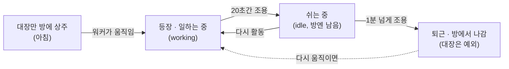

+++
title = "AI 여러 대가 일하는 걸, 네모네모 감마지로 지켜보기"
date = "2026-07-16T11:36:00+09:00"
draft = false
tags = ["hugo", "claude-code", "ai-agent", "electron", "pixijs", "회고"]
categories = ["일지"]
description = "기획 문서 세 개로 시작해 하루 만에 oh-my-openagents 멀티에이전트를 실시간으로 시각화하는 픽셀 데스크탑 펫을 완성한 프로토타입 개발기"
+++

> 기획 문서 세 개로 시작한 하루짜리 프로토타입 개발기

---

## 시작은 가벼웠다

어느 날 나는 AI 에이전트한테 이렇게 던졌다.

> "디렉토리 안의 md 파일 훑어보고, 바이브코딩으로 가능할지 POC 해봐."

폴더에는 예전에 잡아둔 문서 세 개가 있었다. `PRD-opencode-desktop-pet.md`, `VISUAL-CONCEPT.md`, `CHARACTER-CONCEPT.md`. 대충 "OpenCode 세션에서 도는 워커들을 픽셀 아트 데스크탑 펫으로 시각화하자"는 기획이었다. 캐릭터 컨셉엔 요크셔테리어(Sisyphus), 골든 리트리버(Junior), 앵무새(Librarian), 올빼미(Oracle) 같은 동물들이 역할별로 정리돼 있었다.

사실 이 문서 세 개는 그냥 떨어진 게 아니다. 며칠 전 나는 **OpenCode**라는 다른 AI 코딩 도구에서, "뭘 만들 것인가"를 정리하는 기획 문서(개발 쪽에선 PRD, 제품 요구사항 문서라고 부른다)를 먼저 잡아뒀다. 굳이 도구를 나눈 데는 이유가 있었다.

첫째, **아까운 걸 아껴 쓰고 싶었다.** 나는 지금 AI 교육 과정을 들으며 클로드 Pro 플랜을 쓰는데, 이 플랜엔 쓸 수 있는 양에 한계가 있다. 그런데 기획 문서 다듬기는 실제 '코딩'이 아니라 '준비 작업'이다. 정작 중요한 구현에 써야 할 용량을, 준비 단계에서 태워버리는 건 아깝다고 봤다. 한정된 걸 어디에 쓸지 고르는 문제 — 말하자면 기회비용 계산이었다.

둘째, **실험이었다.** OpenCode는 무료 모델로도 돌릴 수 있다. 그 공짜 모델만으로 기획 문서를 무리 없이 뽑을 수 있는지 직접 확인해보고 싶었다.

셋째, **애초에 깊은 고민이 필요한 작업이 아니었다.** 만들고 싶은 그림은 이미 머릿속에 꽤 선명했다. AI한테 필요한 건 대단한 통찰이 아니라, 내 생각을 질문-답변으로 주거니 받거니 하며 문서 형태로 다듬어주는 정도였다. 그 정도면 무료 모델로 충분했다.

결과적으로 이 판단은 절반만 맞았다. 문서는 잘 나왔다. 그런데 **문서에 안 담긴 것** 때문에 나중에 한 번 크게 돌아가게 된다. (그 얘긴 뒤에서.)

기대는 단순했다. "문서 다 있으니까 금방 뽑겠지."

결론부터 말하면, 그날 저녁까지 나는 다크 대시보드를 만들었다가 갈아엎고, 코지룸을 두 번 만들고, 아이소메트릭을 논의하고, 프로젝트의 정체를 다시 정의하고, 버그를 다섯 개 잡고, 결국 **oh-my-openagents 멀티에이전트를 실시간으로 시각화하는 픽셀 데스크탑 펫**을 완성했다. 그 과정을 순서대로 적는다.

---

## 1막: 일단 만든다

기술적인 세팅은 문서에 적어둔 그대로 갔다. 데스크탑에 작은 창 하나를 얌전히 띄우고, 그 안에서 워커 펫들이 상태에 따라 움직이는 그림. 창은 배경이 투명하게 뚫려서, 마치 바탕화면 위에 동물들이 직접 올라앉아 있는 것처럼 보이게 했다.

원래 임시로 들어 있던 그림은 컨셉과 안 맞는 사람 모양 도트였다. 그래서 동물 캐릭터들을 코드로 직접 그렸다. AI로 이미지를 '생성'하는 게 아니라, 점을 하나하나 찍듯 코드로 도트를 '그리는' 방식이다.

작은 격자 안에 쉬는 모습, 일하는 모습, 에러 난 모습을 하나씩 그리고 컨셉대로 색을 입혔다. 요크셔는 핑크 스웨터, 사서 앵무새는 안경, 올빼미는 로브. 이 방식의 장점은, 나중에 더 좋은 그림이 생기면 깔끔하게 갈아끼울 수 있다는 거다.

여기서 잠깐 고백하자면, 리드 역할인 **시시포스**를 요크셔테리어로 정한 데는 절반쯤 이유가 있고 절반쯤은 사심이다.

이유 쪽부터 말하면 — 우리 집 강아지가 요크셔테리어인데, 몸집은 조그만 게 고집이 세고 독립적이다. 시키지 않아도 자기 할 일은 알아서 하고, 안 될 것 같으면 툴툴대면서도 어떻게든 해낸다. 그런데 OMO에서 시시포스는 가장 많은 일을 쉼 없이 처리하는 리드 워커다. 바위를 산 위로 영원히 밀어올리는 그 신화 속 시시포스처럼. 작은 게 고집으로 밀어붙이는 그림이 묘하게 겹쳤다.

그리고 나머지 절반은, 솔직히 그냥 귀여워서다. 내 프로젝트 화면에 우리 집 강아지 닮은 게 종종거리고 있으면 좋잖아. 그게 전부다.


*캐스팅 사유: 귀여움.*

데이터는 AI 워커들이 남기는 기록 파일을 주기적으로 들여다보는 방식으로 가져오기로 했다. 창을 띄우는 프로그램이 그 폴더를 읽어서, 화면 그리는 쪽에 "지금 몇 번 워커가 무슨 상태다"를 넘겨준다. 여기까진 순조로웠다.

그리고 첫 데모를 켰는데 — **텅 빈 화면.**

무슨 일이 있었냐면, 하루 동안 이 빈 화면을 포함해 크고 작은 버그를 다섯 개 잡았다. 그중 1막에서 마주친 건 세 개. 요약하면 이렇다.

- **화면이 텅 비었다** — 캐릭터들이 좌표 계산 실수로 죄다 화면 바깥으로 튀어나가 있었다. 고해상도(레티나) 디스플레이의 '실제 픽셀'과 '화면상 픽셀'이 2배 차이 나는 걸 놓친 탓.
- **그래도 여전히 빈 화면** — 그림 그리는 엔진(PixiJS)이 내부적으로 쓰는 코드 실행 방식을, 내가 걸어둔 보안 설정이 막고 있었다. 외부 콘텐츠를 아예 안 부르는 로컬 앱이라 그 설정을 풀어주니 해결.
- **창 크기를 바꾸면 방이 안 따라온다** — 창을 리사이즈해도 내부 배치가 재계산되지 않던 문제. 창 크기를 실시간으로 감시하도록 바꿔서 잡았다.

세 개를 다 잡고 나니 드디어 화면에 뭔가 떴다. 그런데 이번엔 방향이 문제였다. (그 얘긴 2막에서.)

<details>
<summary>🔧 디버깅 상세 — 같은 함정에 빠진 분만 펼쳐보세요</summary>

### 버그 ①: PixiJS 좌표 단위 (renderer.width vs screen.width)

데모 모드를 켜도 캐릭터가 안 보였다. 원인은 PixiJS v8의 좌표 단위였다. resolution을 devicePixelRatio(=2)로 잡았기 때문에, `renderer.width`(물리 픽셀)로 배치 좌표를 계산하면 캐릭터가 죄다 화면 밖(2배 위치)으로 튀어나갔다.

```js
// 잘못: renderer.width 는 '물리 픽셀'(devicePixelRatio 곱해짐)
const W = app.renderer.width;   // 레티나면 실제의 2배
// 맞음: 스테이지 좌표계는 '논리 픽셀'
const W = app.screen.width;
```

스테이지 배치는 `app.screen` 기준으로 해야 한다.

### 버그 ②: CSP와 PixiJS의 unsafe-eval

PixiJS v8의 WebGL 렌더러는 셰이더/유니폼 동기화 코드를 런타임에 `new Function()`으로 만든다. CSP가 그걸 막아 렌더 파이프라인이 통째로 깨졌다. 캔버스가 빈 채로 뜬 이유.

```html
<!-- 로컬 전용 데스크탑 앱이라 이게 정석 (외부 콘텐츠를 안 부름) -->
<meta http-equiv="Content-Security-Policy"
  content="script-src 'self' 'unsafe-inline' 'unsafe-eval'; img-src 'self' data: blob:; worker-src 'self' blob:; connect-src 'self' data: blob:;">
```

eval을 정 피하려면 `@pixi/unsafe-eval` 플러그인을 쓰면 된다.

### 버그 ③: 리사이즈가 안 먹는다

`app.renderer.on('resize')`에 의존하던 걸 `ResizeObserver`로 stageEl을 직접 관찰하고, 레이아웃을 `stageEl.clientWidth/Height`에서 계산하도록 바꿨다. 초기 렌더 시 `app.screen`이 아직 확정되지 않은 함정도 이걸로 같이 회피했다.

</details>

---

## 2막: 방향이 세 번 바뀐다

### 첫 번째 방향 전환 — 삭막한 대시보드에서 아늑한 방으로

처음 만든 건 문서에 적어둔 그대로였다. 검은 배경에 네온 불빛이 들어오는, 삭막한 "사무실 상황판" 같은 화면. 근데 만들고 보니 내가 진짜 원한 건 그게 아니었다. 바탕화면 위에 둥둥 떠 있는, 보고만 있어도 마음이 놓이는 그런 그림이었다. 굳이 말하자면 포근한 감성의 **로파이 아이들러**[^lofi] 느낌. 잔잔한 분위기의, 작은 방 하나를 그냥 바라보는 그런 감성이었다.

AI한테 그런 분위기의 레퍼런스를 찾아보라 하고 방향을 완전히 틀었다. 삭막한 대시보드를 버리고 **따뜻한 픽셀 방**을 새로 만들었다. 달밤이 보이는 창문, 벽시계, 러그, 화분, 은은한 플로어 램프. 방 크기는 고정해두고, 창 크기가 바뀌면 영화 화면처럼 위아래 여백을 두며 비율을 유지한 채 늘고 줄게 했다. 펫들은 책상에서 일하거나 러그에서 쉬고, 쉴 땐 머리 위에 `zzz`가 떴다.

여기서 배운 것: **원하는 그림의 분위기는 최대한 빨리 꺼내 보이는 게 이득이다.** 내가 이 "포근한 방" 느낌을 처음부터 말했으면, 방을 두 번 만들 일은 없었을 거다.

[^lofi]: 로파이(lo-fi)는 일부러 거칠고 잔잔하게 만든 감성을 뜻하고, 아이들러(idler)는 딱히 조작하지 않아도 알아서 굴러가는 종류의 화면·게임을 말한다. 둘을 합치면 "잔잔하게 바라보는, 방치형" 정도의 분위기.

### 두 번째 방향 전환 — 비스듬히 내려다보는 16비트, 될까?

욕심이 났다. "화면을 정면이 아니라 비스듬히 위에서 내려다보는 시점(쿼터뷰)으로, 좀 더 옛날 게임 같은 16비트 감성으로 못 하나?"

AI의 대답이 솔직해서 좋았다. 요약하면 이랬다 — "흔히 말하는 '그림 그려주는 AI'(이미지 생성 AI)는 나한테 없어서 그림을 뽑아내진 못한다. 대신 **코드로 픽셀 아트를 한 점씩 짜맞추는 건** 된다. 비스듬한 시점도 포함해서. 다만 내 결과물은 깔끔하긴 해도 블록을 쌓은 것처럼 각져서, 사람 도터나 좋은 그림 AI가 뽑는 유기적인 디테일까진 안 나온다."


*코드로 한 점씩 찍은 결과물. 말 그대로 "블록을 쌓은 것처럼" 각졌다.*

말로만 하지 않고 실제로 그 비스듬한 시점의 방을 코드로 하나 뽑아 보여줬다. 마름모꼴 바닥 격자, 뒤쪽 두 벽, 상자 모양 가구까지.


*확인차 코드로 뽑아본 비스듬한 시점의 방. 되긴 된다 — 다만 여기서 문제가 하나 생겼다.*

되긴 됐다. 다만 정면을 보는 캐릭터를 비스듬한 가구에 앉히니 시점이 안 맞아 어색했다. 그래서 결론은 이랬다: **화면을 비스듬히 배치하고 앞뒤 순서를 맞추는 '엔진'은 코드로 직접 만들고, 실제 그림은 무료로 쓸 수 있는 배경 그림 모음(CC0[^cc0])을 가져다 쓰는 것.** 엔진은 그림이 어디서 오든 똑같이 동작하니까. (이 부분은 다음 작업으로 남겨뒀다.)

[^cc0]: CC0는 저작권자가 권리를 포기해 누구나 출처 표기 없이 공짜로 쓸 수 있게 풀어둔 창작물을 말한다. 사실상 '공용' 소스.

### 세 번째 방향 전환 — 사실 핵심은 OpenCode가 아니었다

그리고 진짜 반전. 내가 무심코 한마디 했다.

> "`.omo` 이게 핵심이야. oh-my-openagents. OpenCode가 핵심이 아니라."

`.omo`는 **oh-my-openagents(OMO)** 라는 것이었다. 쉽게 말하면, 여러 전문 AI 에이전트를 한꺼번에 부려서 하나의 목표를 향해 일 시키는 '지휘 체계'다. 기획을 맡는 놈, 전체를 지휘하는 놈, 실제로 코드를 짜는 놈, 조사하는 놈… 이렇게 역할 나눠 병렬로 굴린다. 우리 캐릭터 컨셉의 동물들이 사실은 이 OMO 에이전트들의 역할이었던 거다.

이 한 줄이 프로젝트 전체를 다시 정의했다. 이건 'OpenCode를 보여주는 뷰어'가 아니라 **OMO라는 지휘 체계를 눈으로 보여주는 도구**였다. 그리고 중요한 설계 원칙 하나가 드러났다 — **캐릭터는 에이전트의 '이름'이 아니라 '역할'에 따라 배정**된다는 것. 그래서 그동안 이름만 보고 캐릭터를 붙이려던 게 자꾸 어긋났던 거다.

여기서 도입부의 그 이야기가 회수된다. **"문서에 안 담긴 것 때문에 나중에 크게 돌아가게 된다"**고 했던 것 — 바로 이거였다. 나는 OpenCode에서 기획 문서를 잡을 때 "이게 OMO 전용이고, 캐릭터는 역할 기반이다"라는 걸 분명히 알고 있었다. 그런데 그 맥락은 내 머릿속과 그때의 대화에만 있었지, 넘어온 md 문서 세 개엔 안 담겨 있었다. **무엇을 만들지(what)는 문서로 넘어왔지만, 왜·어떤 맥락에서(why)는 안 넘어온 것.** 도구를 갈아타는 사이 맥락이 새어나간, 흔하지만 아픈 함정이었다.

---

## 3막: "OMO 말고 다른 데서도 되나?" — 하나의 형식으로 맞추기

정체가 분명해지자 나는 한 발 더 나갔다. "이거 OMO 전용으로만 쓰긴 아까운데. 다른 시스템에도 붙일 수 있지 않을까?"

여기서 중요한 걸 하나 깨달았다. 이 화면이 그림을 그리려고 실제로 **필요로 하는 정보는 딱 하나**였다 — "지금 일꾼이 몇 명 있고, 각자 무슨 상태인가." 이름이 뭔지, 어느 프로젝트 소속인지는 사실 아무래도 좋았다. 그냥 "몇 명, 각자 상태" 이 형식만 채워주면 화면은 그려진다.

그렇다면 답은 간단했다. 그 형식만 맞춰줄 수 있으면, 정보가 OMO에서 오든 딴 데서 오든 화면은 똑같이 동작할 거다. 그래서 **데이터가 들어오는 입구를, 상황에 따라 갈아끼울 수 있는 부품처럼** 만들었다.

비유하자면 **만능 여행 어댑터** 같은 거다. 나라마다 콘센트 모양이 다르지만, 어댑터 하나 끼우면 어느 나라 콘센트든 내 기기에 맞게 바꿔준다. 여기서도 마찬가지다. 시스템마다 상태를 부르는 말이 제각각인데 — 어디선 "running", 어디선 "queued", 어디선 "failed" 라고 한다 — 이 제각각인 단어들을 내 화면이 알아듣는 표준 단어(작동 중, 대기 중, 오류 같은)로 통일해주는 '변환기'를 하나 뒀다. 개발 쪽에선 이렇게 표현을 하나로 맞추는 걸 '정규화'라고 부른다.

이 변환기 덕에, 원래 전혀 상관없던 시스템들도 이 화면에 붙일 수 있게 됐다. GitHub Actions[^gha]든, 쿠버네티스[^k8s]든, Celery[^celery] 같은 작업 처리기든 — 각자 자기 방식으로 "지금 뭐가 돌아가는 중이다"만 뱉어주면, 변환기가 그걸 표준 형식으로 바꿔서 화면에 태운다.

실제로 GitHub Actions랑 쿠버네티스가 내뱉는 것과 똑같은 형식의 데이터를 흉내 내 넣어봤더니, 걔네 고유의 단어들("running", "queued", "failed")이 내 표준 단어("작동 중", "대기 중", "오류")로 정확히 번역돼 들어왔다. OMO에만 묶이지 않는, 어디에나 붙는 범용 도구가 된 거다.

[^gha]: GitHub Actions — 코드 저장소에서 테스트나 배포 같은 작업을 자동으로 돌려주는 기능.
[^k8s]: 쿠버네티스(Kubernetes) — 여러 대의 서버에 프로그램을 나눠 띄우고 관리해주는 시스템.
[^celery]: Celery — 시간이 오래 걸리는 작업들을 뒤에서 순서대로 처리해주는 파이썬 도구.

<details>
<summary>🔧 개발자용 — 실제 데이터 형식과 연결 방식</summary>

이 화면이 요구하는 데이터 모델은 딱 하나 — **"워커 N개, 각자 상태"**. 그걸 만족하면 뭐든 붙는다. 그래서 데이터 소스를 플러그형 프로바이더로 추상화했다.

```
공통 워커 모델: { id, session, name, state, updatedAt, task }
표준 상태: working | executing | researching | idle | waiting | error

프로바이더: opencode-json | opencode-db | json-file | http | command | log-tail
```

`stateMap`으로 플랫폼 고유 상태어(running/in_progress/queued/failed…)를 표준 상태로 정규화하고, 이름은 name/agent/title, 상태는 state/status/phase/conclusion 중 뭐가 와도 인식하게 했다. 그 결과:

- **GitHub Actions**: `command` 타입 + `gh run ... --json`
- **쿠버네티스**: `command` + `kubectl get pods -o json | jq ...`
- **Celery / 임의 오케스트레이터**: `json-file`이나 `http`

실제로 gh·kubectl 흉내 JSON을 넣어서 `running→working`, `queued→waiting`, `failed→error`로 정규화되는 걸 확인했다.

</details>

---

## 4막(절정): 진짜 데이터에 물리기, 그리고 딱 한 줄의 함정

이제 흉내가 아니라 진짜 OMO 데이터에 물려야 했다. 도구가 데이터를 어떻게 지켜볼지 세 가지 모드를 뒀다. 하나는 **자동 감지** — 어느 프로젝트를 볼지 미리 정해주지 않아도, 지금 돌아가는 걸 알아서 찾아내는 모드. 다른 둘은 특정 프로젝트만 콕 집어 보거나, 아예 다른 시스템 데이터를 물리는 모드.

자동 감지가 성립하려면 "지금 이 순간 뭐가 활동 중인지"를 알아야 한다. 여기서 쓴 방법이 **최근성**이다. 별거 아니다 — 최근 몇 초 안에 갱신된 것만 '활동 중'으로 치는 거다. 미리 지정 안 해도, 방금 움직인 게 저절로 드러난다.

실제 데이터가 어디 있는지 열어봤다. 예상했던 폴더는 없었고, 대신 `opencode.db`라는 데이터베이스 파일 하나에 **모든 프로젝트의 작업 기록이 한데 모여** 있었다. 어떤 에이전트가, 어느 프로젝트에서, 마지막으로 언제 움직였는지까지 다 들어 있었다. 5개 프로젝트, 23개 세션. 더할 나위 없는 재료였다.

무거운 부품을 새로 설치하는 대신, 맥에 기본으로 깔려 있는 파이썬으로 이 데이터베이스를 읽는 작은 도우미 프로그램을 하나 짜서 물렸다. 여기까지 딱 좋았다.

그리고 켰는데 — **전부 idle(쉬는 중).** OMO를 아무리 돌려도 펫이 꿈쩍을 안 했다.


*분명히 작업은 도는데, 로그엔 전부 "쉬는 중"으로만 찍혔다. 이때의 답답함.*

### 이날의 하이라이트: 범인은 옵션 딱 한 줄이었다

한참을 헤맸다. 분명히 작업은 돌아가는데 화면은 "다들 쉬는 중"이라고 우겼다. 원인은 데이터베이스에 연결하는 옵션, 그중에서도 **단어 하나**였다.

사서 비유로 설명해보겠다. 이 데이터베이스는 실시간으로 기록이 쌓이는 방식이라, 방금 처리된 최신 기록들은 아직 본 장부에 옮겨지기 전 **임시 메모지**에 먼저 적힌다.[^wal]

나는 데이터베이스한테 "읽기만 할 거니까 건드리지 마"라고 안전하게 부탁하려 했는데, 그때 `immutable`(불변)이라는 옵션을 같이 붙였다. 이게 문제였다. 이 옵션은 데이터베이스한테 "이 자료는 절대 안 바뀌어"라고 알려주는 말이다. 그러니 사서가 **"어차피 안 바뀐다며?" 하고 임시 메모지는 쳐다보지도 않은 채, 어제까지 정리된 본 장부만** 읽어준 거다. 그래서 방금 돌린 작업이 화면에 안 잡혔다.

`immutable` 한 단어를 빼자, 사서가 임시 메모지까지 챙겨 읽기 시작했다. 그러자 **24초 전에 방금 한 작업**까지 화면에 잡혔다. 교훈은 짧다 — 실시간으로 계속 쓰이는 데이터베이스를 읽을 땐, "안 바뀐다"고 단정하는 그 옵션을 절대 붙이면 안 된다.

[^wal]: 이 방식을 WAL(Write-Ahead Logging)이라고 부른다. 데이터베이스가 변경 사항을 본체에 곧바로 반영하는 대신, 별도의 기록 파일(임시 메모지)에 먼저 순서대로 적어두는 방식이다. 이렇게 하면 쓰기가 빠르고, 도중에 문제가 생겨도 복구가 안전하다. 대신 '최신 상태'를 제대로 보려면 본체와 이 기록 파일을 함께 읽어야 한다.

<details>
<summary>🔧 개발자용 — SQLite WAL + immutable 실측</summary>

`config.json`에 `watch.mode`를 뒀다. `auto`(전역 저장소 폴링, 프로젝트 무관 자동 감지) / `project`(특정 프로젝트만) / `manual`(다른 플랫폼 소스).

전역엔 `run-continuation` 폴더가 없었다. 대신 `opencode.db`(SQLite)의 `session` 테이블에 모든 프로젝트 세션이 집계돼 있었다 — `agent`, `parent_id`(계층), `directory`, `time_updated`. better-sqlite3 같은 네이티브 의존성을 피하려고 macOS 기본 `python3`로 DB를 읽는 헬퍼(`omo-sessions.py`)를 짜서 `command` 프로바이더로 물렸다. 마지막 활동 시각은 `part` 테이블(툴/메시지 하트비트)의 최신 시각으로 계산.

원인은 DB 연결 옵션 한 줄이었다.

```python
# 잘못: immutable=1 은 -wal 파일을 무시하고 옛 스냅샷만 읽는다
con = sqlite3.connect("file:opencode.db?mode=ro&immutable=1", uri=True)

# 맞음: 라이브로 쓰이는 WAL 모드 DB는 mode=ro 만
con = sqlite3.connect("file:opencode.db?mode=ro", uri=True)
```

opencode.db는 WAL 모드라 실시간 쓰기가 `opencode.db-wal` 파일에 먼저 쌓인다. `immutable=1`은 SQLite에게 "이 파일 안 바뀜"이라고 알려주는 옵션이라 WAL을 통째로 무시하고 옛 스냅샷만 읽는다.

```
immutable=1        → part 1390개, 최신 활동 19.5분 전   (옛 스냅샷)
mode=ro (WAL 반영)  → part 1411개, 최신 활동  0.4분 전   (← 방금 돌린 그 작업!)
```

**교훈: 활발히 쓰이는 WAL 모드 DB를 읽을 땐 `immutable` 절대 금지.** 읽기전용은 `mode=ro`만.

</details>

고치고 다시 켰다. 그리고 내가 한 말은 딱 한 줄이었다.

> "어 잘돼. 아주 잘돼."


*한 단어 고친 뒤. 이제 워커 로그에 제대로 상태가 노출되기 시작했다.*

---

## 5막: 누가 어떤 동물인가, 그리고 펫들의 하루

### 역할로 배정되는 캐릭터

3막에서 드러난 원칙 — 캐릭터는 에이전트의 '이름'이 아니라 '역할'에 따라 정해진다 — 을 실제로 구현했다. 어떤 에이전트가 새로 등장하든, 그 역할만 알려주면 알맞은 동물이 배정되게 했다.[^rolemap] 실제로 돌려보니 OMO에서 활동하던 에이전트들이 전부 제 동물로 잘 매칭됐다.

| 동물 | 역할 | 하는 일 |
|---|---|---|
| 요크셔테리어 | 리드 | 가장 많은 일을 쉼 없이 처리하는 대장 (그 시시포스) |
| 골든 리트리버 | 실행 | 시킨 작업을 실제로 굴리는 일꾼 |
| 앵무새 | 조사 | 필요한 정보를 찾아 물어오는 담당 |
| 웰시코기 | 빌드 | 결과물을 조립하고 만들어내는 담당 |
| 올빼미 | 설계 | 구조를 고민하는 밑그림 담당 |
| 토끼 | 기획 자문 | 계획을 함께 다듬어주는 참모 |

처음엔 실행·조사 계열 동물만 있었는데, 정작 기획하고 지휘하는 상위 역할들의 캐릭터가 비어 있었다. 그래서 그 계열 동물들도 새로 그려 넣어, 로스터를 OMO의 실제 역할 구성에 맞췄다.

[^rolemap]: 매칭은 이름의 일부만 겹쳐도 인식하도록 했고, 더 구체적으로 지정된 규칙을 우선 적용한다. 새 에이전트가 생겨도 설정 파일에 한 줄만 추가하면 된다.

### 자잘한 창 문제 하나

창 크기를 바꾸면 방의 비율이 깨지고, 위쪽에 괜한 여백이 생겨 펫들이 아래로 밀리는 문제가 있었다. 방의 가로세로 비율을 창에 고정하고, 세로 정렬을 위쪽 기준으로 바꿔서 남는 여백이 아래로만 가게 했다. 소소하지만 이런 게 안 맞으면 "만들다 만" 티가 난다.

### 펫들의 하루 — 워커 생애주기

마지막으로 가장 만족스러운 부분. 문제는 이거였다. 지금 안 움직이는 워커까지 죄다 방 안에 서 있으니 화면이 지저분했다. 그래서 펫들에게 **하루의 흐름**을 정해줬다. 사람이 출근하고, 일하고, 잠깐 쉬고, 퇴근하는 것처럼.

- **아침(등장 전)**: 대장(리드)만 방을 지키고 있다.
- **일 시작**: 어떤 워커가 실제로 움직이기 시작하면, 그 동물이 방에 등장해 일하는 모습이 된다.
- **잠깐 멈춤**: 20초쯤 아무 활동이 없으면 '쉬는 중'으로 바뀐다. 아직 방엔 남아 있다.
- **퇴근**: 1분 넘게 조용하면 방에서 나간다. 단, 대장은 예외 — 언제나 방을 지킨다.

그림으로 보면 이렇다.



이 흐름을 화면 그리는 쪽이 아니라 데이터를 다루는 쪽에서 전부 판단하게 만든 게 핵심이었다. 그래서 화면은 그냥 "받은 대로 그리고, 없어지면 치운다"만 하면 됐다. 멈춰 있는 시간 기준(몇 초 쉬면 idle, 몇 초 지나면 퇴장)이나 "대장은 항상 상주" 같은 규칙은 전부 설정으로 빼서, 취향껏 조절할 수 있게 했다. 실제로 돌려보니 작업과 작업 사이 간격에도 화면이 깜빡이거나 튀지 않고 안정적이었다.

<details>
<summary>🔧 개발자용 — 생애주기 파라미터와 검증 로그</summary>

생애주기는 전부 데이터 레이어(`applyLifecycle`)에서 처리했다.

- **init**: 리드(ultraworker)만 방에 상주
- **활동 시작**: 그 워커가 `working`으로 자리에 등장
- **멈춤**: 20초(`activeWindowMs`) 지나면 `idle`로 (방엔 남음)
- **1분 무활동**: `exitWindowMs` 초과 시 방에서 퇴장 (리드는 예외)

실 DB로 시나리오를 검증했다:

```
[init]       5분 전 상태      → 리드만 idle로 상주
[활동시작]    주니어 2초 전     → working으로 자리 추가
[idle 유예]   주니어 35초 전    → idle로 여전히 표시
[퇴장]       주니어 70초 전    → 방에서 퇴장, 리드만 남음
```

`config.json`에서 `activeWindowMs`/`exitWindowMs`/`alwaysShowLead`로 다 튜닝 가능.

</details>

---

## 회고: 바이브코딩에서 뭘 배웠나

이걸 하면서 "AI를 잘 다뤘나"를 스스로 돌아봤다. 정직하게 정리하면 이렇다.

**잘한 것 — 증상만 말하지 않고 원인까지 짚어줬다.** "데모가 안 뜬다", "창 크기를 바꾸니 비율이 깨지는 것 같다", "캐릭터가 화면 밖으로 나간다." 이렇게 그냥 "안 된다"가 아니라 "이래서 안 되는 것 같다"까지 같이 줬더니, 고치는 속도가 훨씬 빨랐다. 마지막 생애주기 지시는 상태와 타이밍까지 명확하게 말해서 한 번에 구현됐다. AI한테 뭘 시킬 땐, 원하는 걸 얼마나 또렷하게 말하느냐가 결과를 가른다.

**개선할 것 — 맥락을 먼저 꺼냈어야 했다.** 이날 가장 크게 돌아간 이유는, "OMO가 진짜 본체"라는 핵심 맥락을 너무 늦게 말한 거였다. 그 한마디를 처음에 안 해서, 엉뚱한 데이터를 뒤지고 캐릭터 배정을 다시 짜야 했다. 무엇을 만들지는 문서로 넘어왔지만, 왜·어떤 맥락에서 만드는지는 넘어오지 않았다.

그래서 다음 프로젝트를 위한 '시작 체크리스트'를 만들었다. 새 작업을 AI와 시작할 때, 이것만 먼저 채우고 들어가자는 것.

```
- 만드는 것:    (한 줄로)
- 어디서·왜:    (무엇 위에서 돌아가고, 왜 만드는지)
- 성공 장면:    (제대로 되면 화면에 뭐가 어떻게 보이는지)
- 지켜야 할 것: (써야 하는/쓰면 안 되는 것)
- 지금은 안 할 것: (나중으로 미룰 것)
```

**마지막으로, '어디까지가 시작 단계냐'에 대해.** 나는 "일단 끝에서 끝까지 한 번은 돌아가게" 만드는 걸 목표로 잡았는데, 알고 보니 이건 개발에서 꽤 알려진 접근이었다.[^skeleton] 방향 자체는 나쁘지 않았던 거다. 다만 다음엔, "제대로 되면 화면에 뭐가 보일지"를 맨 첫 메시지에서 못박고 시작하려 한다.

[^skeleton]: 이런 접근을 '워킹 스켈레톤(walking skeleton)'이라고 부른다. 기능을 하나씩 완성해가는 대신, 처음부터 끝까지를 아주 얇게라도 한 번 관통시켜 "전체가 이어져 돌아가는지"부터 확인하는 방식이다.

---

## 에필로그

우선 분명히 해둘 게 있다. 이건 완성품이 아니라 **프로토타입**이다. 애초에 목표부터가 "이런 걸 실제로 만들 수 있나?"를 확인해보는 거였다. 그 질문엔 답이 나왔다 — 된다. 하루 만에 실제 데이터에 물려 펫들이 움직이는 데까지 갔으니까.

그래서 다음은 여기서부터 키워나가는 일이다. 몇 가지 계획이 있다. 지금은 정면에서 본 방이지만, 2막에서 시도해봤던 **비스듬히 내려다보는 시점**을 제대로 붙여보려 한다. 화면을 배치하는 뼈대는 코드로 짜고, 실제 배경 그림은 무료로 쓸 수 있는 소스를 가져다 얹는 방식으로. 방 분위기도 지금의 달밤 하나뿐이 아니라 **낮이나 노을 같은 테마 변주**를 넣고 싶고, 펫들이 쉬거나 퇴근하는 타이밍도 실제로 오래 써보면서 더 자연스럽게 다듬을 생각이다.

그리고 개인적인 이야기 하나. 솔직히 이 프로젝트를 시작할 때 나는 커리어 공백기가 길어져 자신감이 많이 떨어진 상태였다. 그런데 하루 동안 이걸 만들면서 확인한 게 있다.

공백기에 녹스는 건 문법이나 최신 기술 같은, 어차피 찾아보면 나오는 것들이다. 이날 실제로 쓴 건 그런 게 아니었다. 필요해지기 전에 구조를 미리 고민하는 감각, 문제의 원인을 스스로 짚어내는 직감, 어디까지만 하고 멈출지 정하는 판단, 그리고 옳은 질문을 던지는 능력. 이런 건 잘 안 녹슨다.

자신감이 떨어졌던 건 실력이 없어서가 아니라, 최근에 그걸 증명할 무대가 없었을 뿐이더라.

---

## 부록: 최종 구조

<details>
<summary>🔧 개발자용 — 프로젝트 최종 파일 구조</summary>

```
electron/
  main.js         투명/프레임리스/always-on-top 윈도우, watch 모드 해석, 폴링→IPC
  preload.js      contextBridge (petAPI)
  datasource.js   프로바이더 추상화 + 정규화 + 최근성 생애주기
src/
  index.html / renderer.js / style.css   PixiJS 코지룸 씬, 역할 기반 배정, 데모 모드
tools/
  gen_sprites.py      캐릭터/방 프로시저럴 생성 (PIL)
  gen_iso_room.py     아이소 데모
  omo-sessions.py     opencode.db read-only 조회 (python3, 네이티브 의존성 0)
  watch-source.js     GUI 없이 데이터 확인하는 CLI 워처
config.json           watch/source/stateMap
agent-roles.json      에이전트→역할→캐릭터 매핑
```

</details>
